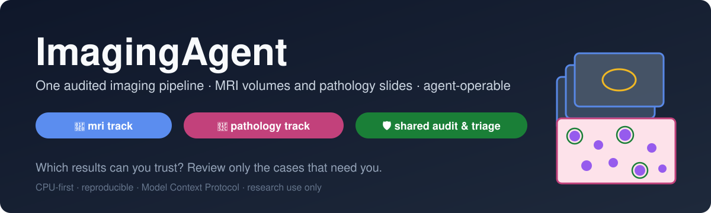
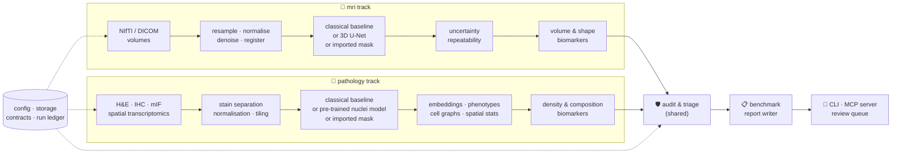

# ImagingAgent 🧠🔬📊



**v0.1.0 (in development)** ·      · [Release notes](CHANGELOG.md)


**A quantitative imaging platform that runs MRI scans and pathology slides
through one audited pipeline, tells you which results to trust, and lets an
agent operate all of it — built from scratch, in public, fully explained,
on a laptop with no GPU.**

> Every term used anywhere in this repo — medical, biological or technical —
> is defined in plain language with an everyday analogy in
> [`docs/00-glossary.md`](docs/00-glossary.md). If a word isn't there, that's
> a documentation bug.

> **New here? Start with the [Handbook](docs/HANDBOOK.md)** — one document that
> walks the whole journey, day 0 to finished product, and links to everything else.

> **Research use only.** Nothing here is a medical device and nothing here
> makes clinical decisions. See [About the data](#about-the-data-honesty-notes).

---

## Contents

- [What is a segmentation? (start here)](#what-is-a-segmentation-start-here)
- [The problem this project tackles](#the-problem-this-project-tackles)
- [How it works](#how-it-works) — two tracks, one shared spine, one audit layer
- [The data at a glance](#the-data-at-a-glance)
- [Results, phase by phase](#results-phase-by-phase) — what is built and what is next
- [Build log](#build-log) — every phase, linked to its guide
- [**The tutorial, in order**](#the-tutorial-in-order) — the documents that teach every step from a blank laptop
- [Roadmap](#roadmap) — what comes next, and the product this becomes
- [About the data (honesty notes)](#about-the-data-honesty-notes)
- [Repository map](#repository-map) — every file, annotated
- [How to run](#how-to-run)
- [How I work on this repo (branch model)](#how-i-work-on-this-repo-branch-model)
- [Why the documentation is so detailed](#why-the-documentation-is-so-detailed)
- [Licence](#licence)

## What is a segmentation? (start here)

Two scenes, one idea.

**A neurologist and a brain scan.** A patient with memory problems has an
MRI — a scanner that photographs the brain in thin slices, like a loaf of
bread cut into hundreds of slices and stacked. Deep inside is the
**hippocampus**, a seahorse-shaped structure the size of your little finger
that is central to memory. In some diseases it shrinks, slowly, years before
anything else shows. If we could measure its volume in cubic millimetres —
and measure it the same way next year — a change in that number would tell
the neurologist something the eye cannot: whether the disease is progressing,
or whether a treatment is holding it back.

**An oncology researcher and a slide.** A tumour biopsy is sliced thinner
than paper, stained so its cells show up (the classic purple-and-pink stain
is called **H&E**), and photographed under a microscope at enormous
resolution — one slide can be a hundred thousand pixels across. On it are
hundreds of thousands of cells: tumour cells, immune cells, blood vessels.
Where the immune cells sit relative to the tumour cells — whether they are
inside it, crowding its edge, or kept out — predicts whether a treatment
that recruits the immune system will work. Counting and locating those
cells by hand is impossible at scale.

In both scenes, the first step is the same: draw a line around the thing you
care about. Around the hippocampus in every slice; around every cell nucleus
on the slide. That outline is a **segmentation**. Everything downstream — the
volume, the cell count, the "how far is each immune cell from the nearest
tumour cell" — is computed from it. If the outline is wrong, every number
built on it is wrong, silently.

One scan or one slide = one **case**. One outlined structure = one
**segmentation**. One number derived from it = one **biomarker**.

## The problem this project tackles

**The pain point.** Segmentation software is usually judged by one average
score on a test set — "Dice 0.91" — and then deployed. But the average hides
the shape of the distribution: a handful of cases fail badly, and in
deployment there is no answer key to compare against, so nobody knows which
ones. Either a specialist reviews every case, which defeats the automation,
or nobody reviews any, and a broken outline quietly becomes a biomarker
inside a decision. In pathology the problem compounds: new "foundation
models" (large pre-trained networks) arrive monthly, their weights are often
locked behind access requests, their benchmarks assume a GPU, and their
robustness to the most mundane real-world variation — a different lab's
stain colours — is rarely reported. And all of these pipelines are usable
only by the person who wrote them.

**What this project does about it.**

1. **One pipeline, two very different kinds of image.** MRI volumes and
   pathology slides go through the same stages — ingest, preprocess,
   segment (or import someone else's segmentation), extract features and
   biomarkers, then audit — with the same data contracts. The MRI side adds
   uncertainty and repeatability; the pathology side adds foundation-model
   embeddings, spatial statistics, cell graphs and multi-modal joins.
2. **An audit and triage layer that works without an answer key.** For each
   case it predicts how likely the segmentation is to be wrong, calibrates
   that prediction against held-out error, and turns it into a **review
   queue with a stated budget**: "the radiologist should look at these 14
   of 200; the rest are safe to accept." Same module, same contract, two
   feature sets — proven on both tracks.
3. **Honest benchmarks on a laptop.** A pathology foundation model against
   general-purpose baselines, under stain shift, with calibration; a deep
   segmentation model against a classical one; a graph neural network
   against plain feature averaging. When the fancy model does not win, the
   report says so and offers a hypothesis.
4. **Agent-operable.** Every capability is exposed as a validated, read-only
   tool over the **Model Context Protocol**, so an agent can list cases, run
   an audit and compare runs — the pipeline stops being usable only by its
   author.
5. **Traceable.** Every run writes a line to an append-only ledger with the
   configuration fingerprint, package version and machine. Every number in
   the documentation points back to one of those lines.

**Why it matters beyond this repo.** In pharma research, imaging biomarkers
decide which patients enter a trial, whether a drug is working, and which
compounds move forward. A biomarker that cannot say how much it can be
trusted is not yet a biomarker.

## How it works

Think of the platform as a building with a shared foundation and two wings.
The foundation — configuration, storage, data contracts, run ledger, command
line, audit layer, benchmark harness, reporting and serving — is built once.
Each wing furnishes it for one kind of image.




**Reading the diagram, left to right.**

- **Ingest.** Images are read with their *geometry* — for a volume, how big
  each voxel is and which way is up; for a slide, how many microns one
  pixel covers and where the tile sits on the slide. Lose that note and
  every measurement is wrong. Public datasets come with download scripts;
  every dataset also has a synthetic stand-in so every command runs offline.
- **Preprocess.** Bring cases onto common ground: the same voxel spacing and
  intensity range for MRI; the same stain appearance for slides.
- **Segment or import.** Three doors into the same contract: an interpretable
  classical method, a learned model, or a label map exported from any other
  tool. The deep model has to beat the classical one to earn its place.
- **Analyse.** MRI: how confident is the model, and how much does the
  biomarker move when nothing real changed? Pathology: what does a
  foundation model "see" in each tile, what kinds of cells are present, and
  how are they arranged?
- **Audit.** One module scores every case's trustworthiness from
  reference-free signals and produces the review queue.
- **Benchmark, report, serve.** Every metric to the ledger; a plain-language
  report per case; the command line, the MCP server and the review
  interface all call the same functions.

**The design rule that makes it reproducible.** Data flows one way and no
step edits its own input. Delete everything except the raw data and the
code, rerun, and you get the same results.

For the full walkthrough see [`docs/02-architecture.md`](docs/02-architecture.md).

## The data at a glance

All public, all de-identified, all with a synthetic fallback so the
repository runs with no download at all. Sizes are recorded exactly at
download time in [`docs/08-data-and-models.md`](docs/08-data-and-models.md).

| Track | Dataset | What it is | Used for | Licence |
|---|---|---|---|---|
| mri | Medical Segmentation Decathlon, Task 04 Hippocampus | 394 small MRI volumes with expert outlines | segmentation, uncertainty, repeatability, biomarkers | CC-BY-SA 4.0 |
| pathology | Kather 2016 colorectal textures | 5,000 H&E tiles in 8 tissue classes, 0.495 µm/px | tissue classification, foundation-model benchmark, stain-shift robustness | CC-BY 4.0 |
| pathology | PanNuke (one fold) | 256×256 H&E tiles with every nucleus outlined and typed (5 types), 0.25 µm/px | nucleus segmentation, cell phenotyping, cell graphs | CC-BY-NC-SA 4.0 |
| pathology | DeepLIIF (test set) | IHC images with pixel-aligned multiplex immunofluorescence of the same tissue | IHC positivity, paired-stain multi-modal check | see data doc |
| pathology | MCMICRO exemplar-001 | one multiplex-immunofluorescence tissue core, 12 channels | mIF segmentation and per-channel positivity | see data doc |
| pathology | 10x Visium sample (via squidpy) | spatial transcriptomics spots with the matching H&E image | image ↔ gene-expression multi-modal learning | see data doc |
| both | synthetic generators (in repo) | hippocampus-like volumes, H&E-like tiles with drawn nuclei, multi-channel fluorescence, spot matrices, case-level covariates | offline runs, tests, teaching | MIT (this repo) |

Pre-trained models (all run on CPU): InstanSeg for nuclei and cells in
brightfield and fluorescence; Phikon (pathology foundation model), DINOv2
and an ImageNet ResNet-50 as embedding baselines; PLIP for zero-shot
classification from text. Details, licences and citations in
[`docs/08-data-and-models.md`](docs/08-data-and-models.md).

## Results, phase by phase

This section fills in as phases land. Every number will trace to a line in
`runs/ledger.jsonl` and to the configuration committed with it; figures are
regenerated by scripts, never pasted.

| Phase | mri | pathology | shared | Status |
|---|---|---|---|---|
| 0 — Skeleton | — | — | config, storage, contracts, ledger, CLI, 31 tests, 3-OS CI | ✅ built |
| 0b — Documentation | — | — | this README, glossary, architecture, roadmaps, data doc | ✅ this release |
| 0c — Two-track refactor | track config, volume geometry | track config, tile geometry | `--track` everywhere, doctor per track | ⏳ next |
| 1 — Ingestion | MSD download, synthetic volumes, NIfTI/DICOM readers | five public datasets, three synthetic generators | case manifest | ⏳ |
| 2 — Preprocessing | resample, normalise, denoise, register | stain separation, normalisation, tissue mask, tiling | augmentation | ⏳ |
| 3 — Segmentation | classical + 3D U-Net, surface metrics | classical + InstanSeg, AJI / PQ | import any label map · **v0.1.0** | ⏳ |
| 4 — Uncertainty & repeatability | TTA, MC-dropout, calibration, minimum detectable difference | — | — | ⏳ |
| 5 — Features & biomarkers | volume, shape, CIs | morphology, phenotypes, positivity, density | one biomarker table | ⏳ |
| 6 — Foundation-model benchmark | — | Phikon vs DINOv2 vs ResNet-50 vs PLIP; stain shift | embedding contract | ⏳ |
| 7 — Spatial & graph learning | — | cell graphs, neighbourhood stats, small GNN | — | ⏳ |
| 8 — Multi-modal | biomarkers ⨝ covariates | H&E ⨝ Visium, IHC ⨝ mIF · **v0.2.0** | join contract | ⏳ |
| 9 — Audit & triage | uncertainty + shape features | blur, folds, stain, OOD, cell-stat features | one audit module, review queue | ⏳ |
| 10 — Benchmark & report | `benchmark --track mri` | `--track pathology` | benchmark report, talk outline | ⏳ |
| 11 — Serving | slices in the review UI | tiles in the review UI | grounded reports, MCP server, Streamlit | ⏳ |
| 12 — Release | — | — | container, GPU path, HPC note · **v0.3.0** | ⏳ |

## Build log

| Phase | What was built | Guide |
|---|---|---|
| 0 | Installable package; typed config with validation and hashing; storage abstraction with a path-traversal guard; contracts that publish JSON Schema; append-only run ledger; `version` · `doctor` · `init` · `config show` · `ledger list`; 31 tests; CI on Windows, macOS, Linux | [`docs/04-phase-tutorials/00-phase-0-skeleton.md`](docs/04-phase-tutorials/00-phase-0-skeleton.md) |
| 0b | Full documentation set for the two-track design | this README and `docs/` |

Bumps hit along the way are kept on purpose in each tutorial's *What could
go wrong* table — including a Windows-only newline bug the three-OS CI
caught before any imaging code was built on top of it.

## The tutorial, in order

Read these in order from a blank laptop; each states its prerequisites,
learning goal, exact commands with expected output, and a checkpoint.

| # | Document | What you learn |
|---|---|---|
| ★ | [`docs/HANDBOOK.md`](docs/HANDBOOK.md) | **start here** — the single live guide from day 0 to the finished product, linking to every document below |
| — | [`docs/00-glossary.md`](docs/00-glossary.md) | every term, with an everyday analogy — open it in a second tab |
| 1 | [`docs/01-setup-windows.md`](docs/01-setup-windows.md) · [`docs/01-setup-macos.md`](docs/01-setup-macos.md) · [`docs/01-setup-rhel8.md`](docs/01-setup-rhel8.md) | building your workshop: Python, Git, editor, GitHub, virtual environment, first passing tests |
| 2 | [`docs/02-architecture.md`](docs/02-architecture.md) | what every box does, why it exists, how data flows — both tracks |
| 3 | [`docs/03-git-workflow.md`](docs/03-git-workflow.md) | the `master` / `beta` / `develop` model, explained line by line |
| 4 | [`docs/04-phase-tutorials/`](docs/04-phase-tutorials/) | one tutorial per build phase, starting with [`00-phase-0-skeleton.md`](docs/04-phase-tutorials/00-phase-0-skeleton.md) |
| 5 | [`docs/05-roadmap.md`](docs/05-roadmap.md) | what each track builds next, symmetric, with triggers |
| 6 | [`docs/06-product-and-technology-roadmap.md`](docs/06-product-and-technology-roadmap.md) | from this repository to an industrialised, cloud-hosted product — every technology evaluated |
| 7 | `docs/07-benchmark-report.md` | methods-paper-style report — *arrives with Phase 10, when there are numbers to report* |
| 8 | [`docs/08-data-and-models.md`](docs/08-data-and-models.md) | every dataset and pre-trained model: source, licence, size, citation, download, synthetic fallback |
| 9 | `docs/09-talk-outline.md` | conference-style talk — *arrives with Phase 10* |
| + | [`docs/TOOL_COOKBOOK.md`](docs/TOOL_COOKBOOK.md) · [`docs/UNINSTALL.md`](docs/UNINSTALL.md) · [`docs/adr/`](docs/adr/) | ready-to-run commands · clean removal · architecture decision records |

## Roadmap

Two roadmap documents, deliberately separate:

- [`docs/05-roadmap.md`](docs/05-roadmap.md) — **what this repository builds
  next**, phase by phase, both tracks treated symmetrically, with the
  trigger for each deferred item (more modalities, larger datasets, gated
  foundation models, virtual staining on GPU, viewer plugins).
- [`docs/06-product-and-technology-roadmap.md`](docs/06-product-and-technology-roadmap.md)
  — **what the finished product looks like**: a web front end with volume
  and whole-slide viewers, integration with 3D Slicer, QuPath and OMERO, a
  data platform, cloud operations, regulatory constraints, and
  go-to-market — each technology given a verdict (required now /
  recommended later / optional / not needed) and the trigger that changes it.

The design choices in this repository — config-driven runs, a storage
interface, typed contracts, a thin command line over reusable functions —
exist so that roadmap is a set of additions, not a rewrite.

## About the data (honesty notes)

- **Real imaging data, public and de-identified.** Every dataset is listed
  with its licence and citation in
  [`docs/08-data-and-models.md`](docs/08-data-and-models.md). PanNuke is
  licensed for non-commercial use; that restriction is inherited by any
  result derived from it and stated wherever such results appear.
- **Synthetic data is labelled as synthetic**, in every file name, every
  contract (`synthetic: true`) and every report it touches. The synthetic
  generators exist so the tutorial runs offline and so tests are fast; they
  prove the pipeline works, not that the science is right.
- **Case-level clinical covariates are simulated.** The public imaging
  datasets carry no clinical metadata; the covariate table used for
  stratification demonstrations is generated by a seeded script and says
  so in its header.
- **Small models, honest claims.** A 3D U-Net trained on a few hundred
  hippocampus volumes and a graph network trained on one fold of PanNuke
  prove *workflow competence* — that the pipeline, the evaluation and the
  audit are built correctly — not clinical performance. The benchmark
  report reports the deep model losing to the classical baseline when it
  does.
- **Research use only.** No output of this software is a diagnosis, a
  treatment decision or a medical device. The review queue is a tool for a
  qualified reviewer, never a replacement for one.

## Repository map

```
imagingagent/
├── README.md                          ← you are here
├── CHANGELOG.md                       what changed in each version
├── CONTRIBUTING.md                    branch model, daily loop, release flow, symmetry rule
├── LICENSE                            MIT
├── pyproject.toml                     build recipe, dependencies, extras, tool settings
├── requirements.txt                   exact core pins  ·  requirements-dev.txt: + test/lint tools
├── .github/workflows/ci.yml           tests on Windows, macOS, Linux at every push
├── .gitignore                         data, runs, models, environments stay out of Git
├── configs/
│   └── default.yaml                   the run configuration, every value commented
├── data/                              raw / interim / processed — created by `imagingagent init`
├── runs/                              run outputs and the ledger (runs/ledger.jsonl)
├── models/                            trained weights (later phases)
├── src/imagingagent/                  the package
│   ├── __init__.py                    version and a map of the layers
│   ├── config.py                      typed configuration
│   ├── storage.py                     storage interface + local backend
│   ├── schemas.py                     data contracts (cases, findings, reports, runs)
│   ├── ledger.py                      append-only run history
│   ├── cli.py                         the command line
│   └── utils.py                       hashing, timestamps, identifiers
├── tests/                             one test file per module
└── docs/
    ├── HANDBOOK.md                    start here — the live end-to-end guide
    ├── 00-glossary.md                 every term, both modalities
    ├── 01-setup-{windows,macos,rhel8}.md
    ├── 02-architecture.md
    ├── 03-git-workflow.md
    ├── 04-phase-tutorials/            one file per phase
    ├── 05-roadmap.md                  this repository's next steps
    ├── 06-product-and-technology-roadmap.md
    ├── 08-data-and-models.md          every dataset and model: source, licence, size, download
    ├── TOOL_COOKBOOK.md · UNINSTALL.md
    ├── adr/                           architecture decision records (six so far)
    └── img/                           cover, architecture, geometry and audit illustrations
```

Later phases add `src/imagingagent/tracks/mri/`, `tracks/pathology/`,
`audit/`, `benchmark/`, `report/`, `serve/`, `scripts/` (dataset downloads,
synthetic generators, figure regeneration) and one tutorial per phase; each
is added to this map when it lands.

## How to run

**Once per machine — the setup guide for your operating system:**
[Windows](docs/01-setup-windows.md) · [macOS](docs/01-setup-macos.md) · [RHEL 8](docs/01-setup-rhel8.md).
Each ends with a passing test suite.

**Every session after that** (bash on macOS/Linux; PowerShell shown where it differs):

```bash
cd ~/projects/imagingagent            # PowerShell: cd $HOME\projects\imagingagent
source .venv/bin/activate             # PowerShell: .\.venv\Scripts\Activate.ps1
imagingagent doctor --config configs/default.yaml   # health check: Python, config, folders, optional extras
imagingagent init                     # create data/ and runs/ folders, write the first ledger line
pytest                                # 31 passed
```

Track commands arrive with their phases and are documented in each phase
tutorial and in [`docs/TOOL_COOKBOOK.md`](docs/TOOL_COOKBOOK.md); the shape
they will take is fixed now:

```bash
imagingagent ingest   --track mri        # or --track pathology
imagingagent segment  --track pathology --method instanseg
imagingagent audit    --track mri --review-budget 0.10
imagingagent benchmark --track pathology
imagingagent serve mcp                   # expose the pipeline to an agent
```

## How I work on this repo (branch model)

Three long-lived branches: `master` (released), `beta` (finished phases,
pre-release) and `develop` (daily work). All work happens on local
`develop`; at the end of every phase the tested state is pushed to all three:

```bash
git switch develop
git add -A
git commit -m "phase-N: what this phase built"
git push origin develop develop:beta develop:master
# add --tags only when a release tag was created in this phase

git switch master
git pull --ff-only origin master
git switch develop
```

Every line is explained in [`docs/03-git-workflow.md`](docs/03-git-workflow.md);
the working agreement is [`CONTRIBUTING.md`](CONTRIBUTING.md).

## Why the documentation is so detailed

Because documentation quality is a deliverable, not an afterthought. Every
tutorial assumes zero prior knowledge of imaging, pathology, machine
learning, Python, Git or the command line, and explains the *why* before
the *how*. A stranger who clones this repository should be able to
reproduce every step, learn every concept, and end up able to extend it —
and I should be able to do the same after a month away. If a step is
unexplained, that is a bug; open an issue.

## Licence

MIT — see [`LICENSE`](LICENSE). Datasets and pre-trained models carry their
own licences, listed in [`docs/08-data-and-models.md`](docs/08-data-and-models.md).
