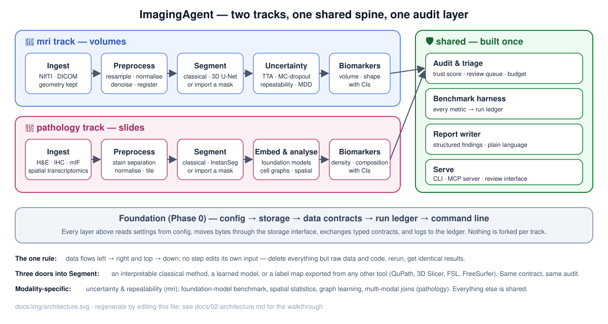
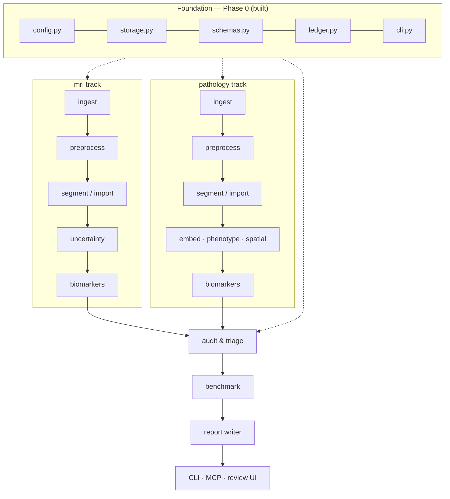
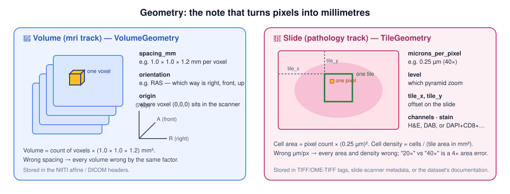
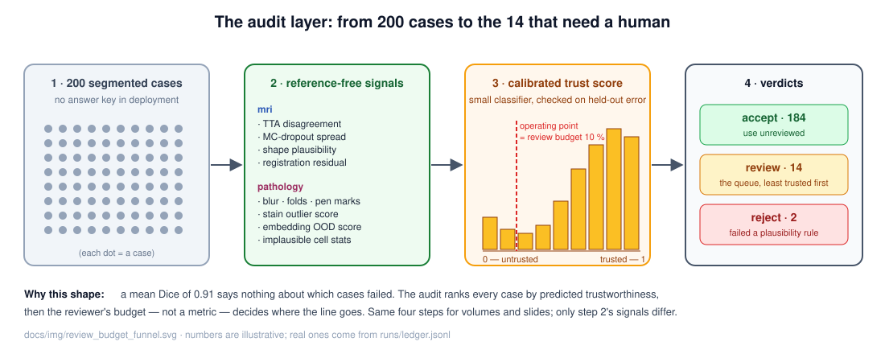

[← README](../README.md) · [Handbook](HANDBOOK.md) · [All docs in order](../README.md#the-tutorial-in-order) · [Glossary](00-glossary.md)

# 02 — Architecture: how ImagingAgent fits together

**Prerequisites:** none. Read this before building anything.
**Learning goal:** after this page you can explain what every part of the
platform does, why it exists, how the two tracks share one foundation, and
how data flows from a raw scan or slide to a review queue — in plain words.

---

## Three words you need first

- **Database** — organised storage you can question. ImagingAgent does not
  use a database server today: results are files with a fixed shape (JSON,
  CSV, NIfTI, TIFF) under one folder, plus an append-only ledger. That is
  deliberate — a folder of well-shaped files is simpler, portable and
  enough for one team. A database is a roadmap item with a trigger
  ([`06-product-and-technology-roadmap.md`](06-product-and-technology-roadmap.md)).
- **Backend** — the code that does the work: reading images, segmenting,
  measuring, auditing. Users never see it, only its results. Almost all of
  this repository is backend.
- **Frontend** — what a human looks at and clicks. Ours arrives in Phase
  11: a Streamlit review queue, plus the command line and the MCP server
  (front doors for scripts and agents rather than for people).

## The diagram

Read it left to right within a track, then right into the shared column,
and remember that the foundation bar underneath is what every box stands on.

## What each box does, and why it exists

### The foundation (already built — Phase 0)

**`config.py` — what a run should do.** Every number that could reasonably
change (which dataset, the review budget, plausibility bounds) lives in
`configs/default.yaml` and is validated on load. *Why:* a run is only
reproducible if its settings are written down and checked; a typo that
turns 10 % into 10 must fail loudly. The configuration's fingerprint goes
into the ledger with every run.

**`storage.py` — where bytes live.** One interface (`write_bytes`,
`read_bytes`, `exists`, `delete`, `list_keys`, `local_path`) and one
backend today, a local folder. *Why:* whole-slide images are tens of
gigabytes and a real deployment keeps them in cloud buckets; because
nothing else touches the disk directly, that backend can be added later
without changing a line of pipeline code.

**`schemas.py` — the contracts.** Typed shapes for a case, a finding, an
audit report, a run. *Why:* two tracks can only share an audit layer if
they hand it the same shape. The contracts also describe themselves (JSON
Schema), which is what an agent needs to call a tool correctly.

**`ledger.py` — the run history.** One JSON line per run start and finish:
who ran what, when, with which config fingerprint, on which machine.
*Why:* provenance. Every number in every report must be traceable to a
ledger line.

**`cli.py` — the front door for humans and scripts.** A thin skin: every
command calls package functions and computes nothing itself. *Why:* the MCP
server and the review interface will call the same functions, so "by
hand" and "by agent" are one code path.

### Ingest (Phase 1) — reading images *with their geometry*

Geometry is the note that turns pixel counts into millimetres. For a
volume it is voxel spacing, orientation and origin; for a slide it is
microns per pixel, pyramid level, tile offset and the channel list.

*Why a separate contract per family (`VolumeGeometry`, `TileGeometry`)?*
Because they answer the same question with different fields, and a
biomarker computed without the right one is silently wrong by a constant
factor — the kind of error that survives every downstream check. Each
reader asserts its geometry in a test.

Ingestion also owns **downloads** (public datasets, with checksums and
licences recorded in [`08-data-and-models.md`](08-data-and-models.md)) and
**synthetic stand-ins** (a hippocampus-like volume; an H&E-like tile with
drawn nuclei; a multi-channel fluorescence tile; a spot-by-gene matrix), so
every command runs with no download and every test runs in seconds.

### Preprocess (Phase 2) — common ground

MRI: resample to a common voxel size, normalise intensity, denoise, rigidly
register to a reference. Pathology: separate the stains (colour
deconvolution), normalise stain appearance to a reference (Macenko), mask
tissue from glass, cut tiles at a chosen resolution. *Why a separate,
documented layer:* every later measurement depends on it, and a reviewer
must be able to see exactly what was done to an image before believing a
number computed from it. Both tracks also produce **augmentation** here —
deliberately varied copies — used later to test robustness.

### Segment or import (Phase 3) — three doors into one contract

1. **Classical** — thresholds, morphology, watershed. Interpretable and the
   bar a learned model must clear.
2. **Learned** — a 3D U-Net (MONAI) for the hippocampus; a pre-trained
   nucleus/cell model (InstanSeg) for slides in brightfield *and*
   fluorescence.
3. **Imported** — a label map made by any other tool (3D Slicer, FSL,
   FreeSurfer, QuPath) read into the same contract.

*Why three:* in practice, segmentations arrive from vendors and platforms
and the real question is whether to trust them. The audit must not depend
on which door was used. Metrics — Dice, HD95 and NSD for volumes; Dice,
AJI and PQ for instances — are computed here where a reference exists, and
per-case failures are listed, never only a mean.

### Analyse — the modality-specific middle

**MRI: uncertainty and repeatability (Phase 4).** Test-time augmentation
and Monte Carlo dropout give per-case disagreement; calibration checks
whether that disagreement predicts actual error. A perturbation study
re-measures the same case under realistic acquisition changes and reports
the **minimum detectable difference** — the smallest change a clinical
team could distinguish from noise.

**Pathology: representation, phenotypes, space (Phases 5–8).** Per-cell
features (size, shape, intensity, texture) and cell types; per-channel
positivity for IHC/mIF; tile **embeddings** from a pathology foundation
model benchmarked against general-purpose models under stain shift; **cell
graphs** and spatial statistics (which cell types neighbour which); a small
graph neural network against a feature-averaging baseline; **multi-modal**
joins — H&E embeddings to Visium gene expression, IHC to registered mIF.

**Both: biomarkers with confidence intervals (Phase 5)** in one tabular
contract, and **joins to case-level covariates (Phase 8)** for
stratification.

### Audit and triage (Phase 9) — the shared heart

One module, one contract, two feature sets. For every case it computes
reference-free signals, turns them into a calibrated trust score, applies
hard plausibility rules, and produces verdicts — `accept`, `review`,
`reject` — with the operating point chosen to match a **review budget**
the user states in config. *Why here and not inside each track:* a triage
policy that must be maintained twice will drift twice.

### Benchmark, report, serve (Phases 10–11)

`imagingagent benchmark --track …` reruns evaluation and writes every
metric to the ledger and to figures regenerated by script; the benchmark
report and talk outline are built from those files, never pasted. The
**report writer** turns structured findings into a plain-language summary
where every sentence is grounded in a computed number (a template by
default; a language-model backend optionally, never inventing). The
**MCP server** exposes ingest, preprocess, segment, features,
uncertainty, embed, spatial, audit, benchmark and report as validated,
read-only tools; the **Streamlit** review queue shows slices or tiles with
overlays for the cases the audit flagged.

### Release (Phase 12)

A container (Docker, Podman-compatible for RHEL 8), a free-GPU notebook
path for anyone wanting larger models, an HPC scheduler note, and the
release tag.

## The rule that makes it reproducible

Data flows one way and no step edits its own input: `data/raw/` is never
modified; every stage writes to `data/interim/`, `data/processed/` or
`runs/<run_id>/`. Delete everything except `data/raw/` and the code, rerun,
and the results are identical. Seeds are fixed in config; the ledger
records the config fingerprint; datasets are checksummed at download.

## The symmetry rule

Every capability phase (ingest, preprocess, segment, features, audit,
report, serve) delivers for **both** tracks in the same phase, with the
same command shape (`--track mri` / `--track pathology`), the same tests
and the same tutorial structure. Modality-specific phases (uncertainty and
repeatability; foundation models, spatial, graphs, multi-modal) belong to
one track and say so. A track that falls behind is a bug in the plan, not
a feature of it.

## Where each phase lives

| Phase | Tutorial | Layer | Package location (when built) |
|---|---|---|---|
| 0 | [`04-phase-tutorials/00-phase-0-skeleton.md`](04-phase-tutorials/00-phase-0-skeleton.md) | foundation | `config.py` `storage.py` `schemas.py` `ledger.py` `cli.py` |
| 0c | [`04-phase-tutorials/00c-two-track-refactor.md`](04-phase-tutorials/00c-two-track-refactor.md) | foundation | `modality.py`, track configs, geometry contracts |
| 1 | `04-phase-tutorials/01-ingestion.md` | ingest | `tracks/mri/io.py`, `tracks/pathology/io.py`, `scripts/download_*.py`, `scripts/synth_*.py` |
| 2 | `04-phase-tutorials/02-preprocessing.md` | preprocess | `tracks/*/preprocess.py` |
| 3 | `04-phase-tutorials/03-segmentation.md` | segment / import | `tracks/*/segment.py`, `tracks/*/metrics.py` |
| 4 | `04-phase-tutorials/04-uncertainty-repeatability.md` | analyse (mri) | `tracks/mri/uncertainty.py` |
| 5 | `04-phase-tutorials/05-features-biomarkers.md` | analyse (both) | `tracks/*/features.py`, `biomarkers.py` |
| 6 | `04-phase-tutorials/06-foundation-model-benchmark.md` | analyse (pathology) | `tracks/pathology/embed.py` |
| 7 | `04-phase-tutorials/07-spatial-graph.md` | analyse (pathology) | `tracks/pathology/spatial.py`, `graph.py` |
| 8 | `04-phase-tutorials/08-multimodal.md` | analyse (both) | `multimodal.py` |
| 9 | `04-phase-tutorials/09-audit-triage.md` | audit | `audit/` |
| 10 | `04-phase-tutorials/10-benchmark-report.md` | benchmark | `benchmark/` |
| 11 | `04-phase-tutorials/11-serving.md` | serve | `report/`, `serve/mcp_server.py`, `serve/review_app.py` |
| 12 | `04-phase-tutorials/12-release.md` | release | `Dockerfile`, `notebooks/colab_gpu.ipynb` |

Tutorial files are created by their phases; names above are fixed now so
links written today resolve then.

## Checkpoint

You can answer, in one sentence each: what geometry is and why two
contracts exist; what the three doors into Segment are; why the audit is
shared; what the one-way data rule buys you; what the symmetry rule
forbids.

Next: [`01-setup-<your OS>.md`](../README.md#how-to-run), or return to the
[Handbook](HANDBOOK.md).
