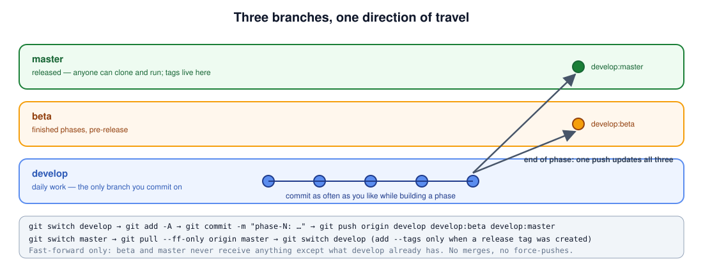

[← README](../README.md) · [Handbook](HANDBOOK.md) · [All docs in order](../README.md#the-tutorial-in-order) · [Glossary](00-glossary.md)

# 03 — The Git workflow: `master` / `beta` / `develop`

**Prerequisites:** the setup guide for your operating system, finished
(Git installed, name and email configured, a GitHub account and token).
**Learning goal:** you can explain what a repository, a commit, a branch and
a remote are; you can create this project's three branches from scratch;
and you can run the end-of-phase push block knowing what every line does.

Commands are identical on Windows (PowerShell), macOS and Linux unless
marked.

---



## Four words, with a picture

- A **repository** ("repo") is a folder whose history Git tracks. The
  history lives in a hidden `.git` folder inside it.
- A **commit** is a snapshot of every tracked file at one moment, with a
  message saying what changed and why. Save-game slots.
- A **branch** is a named line of commits. Picture a tree: the trunk is one
  branch; a side branch grows from a point on the trunk and can later be
  merged back. Branches let "work in progress" and "released" coexist.
- A **remote** is a copy of the repository somewhere else — here, GitHub.
  `origin` is the conventional name for the main remote. **Push** sends
  your commits up; **pull** brings theirs down.

```
master   ●────────────●────────────●   released (v0.1.0, v0.2.0 …)
          \            \
beta       ●────●───────●────●          finished phases, pre-release
                 \            \
develop           ●──●──●──●───●──●     daily work
```

This project uses three long-lived branches:

| Branch | Meaning | Rule |
|---|---|---|
| `master` | Released. Anyone can clone this and it works. Tags live here. | Only updated by the end-of-phase push block |
| `beta` | Finished phases that may still get fixes before release | Same |
| `develop` | Where all work happens | You commit here, as often as you like |

**Why not just one branch?** Because a stranger landing on the repository
should find a working version (`master`) even while the next phase is
half-built (`develop`). Three branches answer three questions: what is
released, what is finished, what am I doing now.

---

## Part A — Creating the repository for the first time (done once)

Skip Part A if you cloned from GitHub in the setup guide — the branches
already exist. Part A is for creating the repository from a project folder
that is not yet under version control.

### A1 — Create the empty repository on GitHub

1. Log in, click **+** (top right) → **New repository**.
2. Name: `imagingagent`. Public. **Leave every box unticked** — no README,
   no `.gitignore`, no license; the project folder already contains all three.
3. Click **Create repository**. GitHub shows a page of commands; ignore it
   and use the ones below.
4. If GitHub's default branch setting is `main`: after the first push,
   **Settings → General → Default branch** → switch to `master`.

### A2 — Turn the folder into a repository

In the project folder, with `.venv` active:

```bash
git init -b master
git status
```

**Success looks like:** `On branch master` followed by a list of "Untracked
files". `-b master` names the first branch; without it Git would use
whatever your global default is.

**If it fails** with `unknown switch 'b'` → your Git is older than 2.28.
Run `git init` then `git branch -m master`.

### A3 — First commit

```bash
git add -A
git commit -m "phase-0a: repository skeleton, typed config, storage abstraction, run ledger, CLI, tests, CI"
```

`git add -A` stages every file not excluded by `.gitignore` (so `.venv/`,
`data/`, `runs/` never get in). `git commit` takes the snapshot.

**Verify:** `git log --oneline` shows one line.

### A4 — Connect to GitHub and push `master`

```bash
git remote add origin https://github.com/akannan2987/imagingagent.git
git push -u origin master
```

Replace `akannan2987` with your own username if different. The first push
asks for your username and, as password, the **personal access token** from
the setup guide. `-u` records that local `master` tracks `origin/master`,
so plain `git pull` and `git push` work from then on.

**Success looks like:** several lines ending in
`branch 'master' set up to track 'origin/master'.`

**If it fails** with `Authentication failed` → you typed your GitHub
password instead of the token, or the token lacks the `repo` scope.
`remote: Repository not found` → the URL or username is wrong, or the
repository was not created yet.

### A5 — Create `beta` and `develop` from `master`

```bash
git switch -c beta
git push -u origin beta
git switch -c develop
git push -u origin develop
```

`switch -c` creates a branch from the current one and moves to it. After
this, all three branches point at the same commit.

**Verify:**

```bash
git branch -a
```

**Success looks like:**

```
  beta
* develop
  master
  remotes/origin/beta
  remotes/origin/develop
  remotes/origin/master
```

The `*` marks where you are: `develop`. Stay there.

---

## Part B — The end-of-phase push block (done at the end of every phase)

Each phase tutorial ends with exactly this:

```bash
git switch develop
git add -A
git commit -m "<phase-specific message>"
git push origin develop develop:beta develop:master
# add --tags only when a release tag was created in this phase
git switch master
git pull --ff-only origin master
git switch develop
```

Line by line:

1. `git switch develop` — make sure you are on the working branch.
2. `git add -A` — stage everything that changed.
3. `git commit -m "..."` — snapshot with the phase's message.
4. `git push origin develop develop:beta develop:master` — three pushes in
   one command. `develop` updates the remote `develop`; `develop:beta`
   means "push my local `develop` to the remote branch `beta`";
   `develop:master` likewise. Because `beta` and `master` were created
   from `develop`'s history and only ever updated this way, these pushes
   are fast-forwards: the remote branch just moves forward to the new
   commit, nothing is merged.
5. `--tags` — only when a release tag was made (see Part C).
6. `git switch master` then `git pull --ff-only origin master` — bring your
   local `master` up to date. `--ff-only` refuses if a fast-forward is
   impossible; that would mean something reached `master` outside this
   flow and should be investigated rather than merged over.
7. `git switch develop` — back to work.

**If push line 4 is rejected** with `! [rejected] ... (non-fast-forward)`:
the remote branch has commits yours does not. Run `git fetch origin` and
`git log --oneline develop..origin/master` to see what they are. Never
force-push `master` or `beta`.

---

## Part C — Releasing a version

1. In `CHANGELOG.md`, move the `[Unreleased]` items under a new heading
   `## [0.1.0] - 2026-09-01`.
2. Check `pyproject.toml` and `src/imagingagent/__init__.py` carry the same
   version.
3. Commit on `develop`, then tag the commit:

```bash
git tag -a v0.1.0 -m "ImagingAgent v0.1.0"
```

4. Run the Part B block **with** `--tags` on the push line:

```bash
git push origin develop develop:beta develop:master --tags
```

5. On GitHub: **Releases → Draft a new release → choose tag v0.1.0**, paste
   the changelog section, publish.

---

## Everyday commands you will use constantly

| Command | What it does |
|---|---|
| `git status` | What changed since the last commit |
| `git diff` | The exact line changes |
| `git log --oneline -10` | The last ten commits |
| `git switch develop` | Move to a branch |
| `git pull` | Get remote commits for the current branch |
| `git restore <file>` | Throw away uncommitted edits to one file |
| `git stash` / `git stash pop` | Park uncommitted work / bring it back |

---

## Checkpoint

- [ ] `git branch -a` lists `beta`, `develop`, `master` locally and on `origin`
- [ ] GitHub shows the repository with `master` as default branch and the CI workflow (Actions tab) running
- [ ] You are on `develop` (`git branch` shows `* develop`)

Next: [`04-phase-tutorials/00-phase-0-skeleton.md`](04-phase-tutorials/00-phase-0-skeleton.md).
