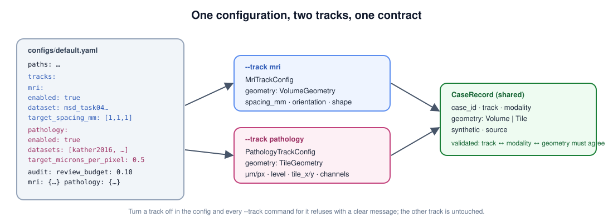

[← README](../../README.md) · [Handbook](../HANDBOOK.md) · [All docs in order](../../README.md#the-tutorial-in-order) · [Glossary](../00-glossary.md)

# Phase 0c — The two-track refactor: making "which kind of image?" a first-class idea

**Prerequisites:** [Phase 0](00-phase-0-skeleton.md) finished, tests passing.
**Learning goal:** after this phase you can explain what a *track* is, how one
configuration file drives two of them, why geometry needs two shapes, what a
registry is, and how to change a contract without breaking the tests that
protect it. You will also have regenerated every illustration from a script.
**Time:** about 1.5–2 hours. **CPU:** under a minute.



---

## Why this phase exists

The skeleton was written with one modality in mind: its configuration had a
single `dataset:` block and its case contract carried `spacing_mm`, which
only makes sense for a volume. A slide has no voxel spacing; it has microns
per pixel, a pyramid level, and a position on the slide. Bolting the slide
track onto that later would mean every module carrying "if volume … else
tile …" branches forever.

So before any imaging code is written, the platform learns the word
**track** — a modality family with its own configuration, its own geometry
shape, and its own set of optional libraries — while everything shared
(storage, ledger, contracts, command line) stays single. *Analogy:* before
building two wings on a house, you fix where the shared corridor runs.

Everything in this phase is a *change to an existing file*. Every one of the
31 tests from Phase 0 is kept; four are updated in place because the
contract they test changed shape, and 22 new tests are added. Nothing is
deleted.

---

## 1. The configuration grows a `tracks:` block

**What.** Open `configs/default.yaml`. The old top-level `dataset:` block is
gone; in its place:

```yaml
tracks:
  mri:
    enabled: true
    dataset: { name: msd_task04_hippocampus, ... }
    target_spacing_mm: [1.0, 1.0, 1.0]
  pathology:
    enabled: true
    datasets:
      - { name: kather2016, role: tissue, ... }
      - { name: pannuke,    role: nuclei, ... }
      ...
    target_microns_per_pixel: 0.5
```

and `audit:` gains per-track plausibility rules under `audit.mri` and
`audit.pathology`, while `review_budget_fraction` stays shared.

**Why.** A track is switched on or off in one place; a command run with
`--track pathology` refuses cleanly if that track is disabled. The
pathology track has five datasets because it covers five kinds of image
(H&E tissue, nuclei, IHC, multiplex IF, spatial transcriptomics), each with
a **role** so code can ask "which dataset plays the nuclei role?" instead of
hard-coding a name.

**In `config.py`:** `MriTrackConfig`, `PathologyTrackConfig` (with a
`dataset(role)` lookup), `TracksConfig` (with `enabled_names()` and
`get(name)`), `MriAuditConfig`, `PathologyAuditConfig`, and
`ProjectConfig.require_track(name)` which raises a clear error for an
unknown or disabled track. The YAML file and the code defaults must still
agree — the test from Phase 0 enforces it.

**Do this:**

```bash
imagingagent tracks --config configs/default.yaml
```

**Success looks like:**

```
mri         : enabled
  dataset   : msd_task04_hippocampus (MRI, CC-BY-SA 4.0)
  spacing   : (1.0, 1.0, 1.0) mm
  synthetic : fallback on (20 cases, seed 20260901)
pathology   : enabled
  dataset   : kather2016             role=tissue   on   CC-BY 4.0
  dataset   : pannuke                role=nuclei   on   CC-BY-NC-SA 4.0
  ...
audit       : review budget 10%
```

Now switch a track off. Create `configs/mri_only.yaml` containing:

```yaml
tracks:
  pathology:
    enabled: false
```

and run `imagingagent tracks --config configs/mri_only.yaml`. The pathology
lines now read `disabled`. Keep the file; it is a useful example config.

---

## 2. Geometry becomes two shapes

**What.** In `schemas.py`, `CaseRecord.spacing_mm` and `shape` are replaced
by one field, `geometry`, which is *either* a `VolumeGeometry` *or* a
`TileGeometry`:

| `VolumeGeometry` (scan) | `TileGeometry` (slide) |
|---|---|
| `spacing_mm` (x, y, z) | `microns_per_pixel` |
| `shape` (voxels per axis) | `width`, `height` |
| `orientation` (e.g. RAS) | `level` (pyramid zoom) |
| `origin_mm` | `tile_x`, `tile_y` (position on the slide) |
| `voxel_volume_mm3`, `volume_mm3(n)` | `channels`, `stain`, `pixel_area_um2`, `area_mm2(n)` |


**Why.** Both answer the same question — "how big is one pixel in the real
world?" — with different fields. Putting both in one record would leave half
the fields empty and invite a volume computed with the wrong one. A
**discriminated union** (pydantic picks the shape from the `kind` field)
keeps each record honest and still lets one `CaseRecord` serve both tracks.

`CaseRecord` also gains a `track`, and a **validator** — a rule that runs
when a record is created — checks three things agree: the track, the
modality, and the geometry kind. An H&E case on the `mri` track, or an MRI
case with tile geometry, is rejected at creation with a message saying why.
The old `spacing_mm` and `shape` names survive as read-only conveniences so
nothing else broke.

**Do this** — in the Python interpreter (`python`):

```python
from imagingagent.schemas import CaseRecord, TileGeometry, VolumeGeometry, Track, Modality
v = VolumeGeometry(spacing_mm=(1.0, 1.0, 1.2), shape=(35, 50, 35))
v.volume_mm3(2500)                 # → 3000.0  (2500 voxels × 1.2 mm³ each)
t = TileGeometry(microns_per_pixel=0.5, width=150, height=150)
t.tile_area_mm2                    # → 0.005625
CaseRecord(case_id="x", track=Track.MRI, image_key="x.tif", modality=Modality.HE)   # → ValidationError: belongs to track 'pathology'
exit()
```

The last line failing *is* the feature: a mismatched record cannot exist.

---

## 3. A modality registry — the roadmap, in code

**What.** New file `src/imagingagent/modality.py`: a lookup table of every
modality the platform knows about — implemented (MRI, H&E, IHC, mIF,
spatial transcriptomics, synthetic) and **planned** (CT, PET, DXA,
ultrasound, ophthalmic, Xenium) — each with its track, geometry kind,
typical file extensions and a one-line description.

**Why.** A roadmap that lives only in a document drifts from the code. Here
`imagingagent modalities` always prints the honest picture, the case
validator reads the same table, and adding a modality later is one entry
plus a reader. *Analogy:* a restaurant's menu that also marks "coming
soon" dishes — printed from the same list the kitchen uses.

**Do this:**

```bash
imagingagent modalities
imagingagent modalities --track pathology
```

**Success looks like:** a table with `implemented` rows first, then
`planned` rows, and the second command showing only the slide modalities.

---

## 4. The command line learns `--track`

**What.** `doctor`, `modalities` and `ledger list` accept `--track mri` or
`--track pathology`; `doctor` now groups optional libraries under `[mri]`,
`[pathology]` and `[serve]` headings; `tracks` and `modalities` are new
commands; the ledger records which track a run served.

**Do this:**

```bash
imagingagent doctor --config configs/default.yaml --track pathology
imagingagent doctor --config configs/default.yaml --track ultrasound
```

**Success looks like:** the first prints only the `[pathology]` group and
`result       : healthy`; the second exits with code 2 and
`error: unknown track 'ultrasound'; expected one of mri, pathology`.

---

## 5. Per-track extras and the lock file

**What.** `pyproject.toml` declares optional extras `mri`, `pathology`,
`serve` and `all` (ranges only). The exact, verified pins arrive as
`requirements-<track>.txt` with the phases that need them — those files
also select the CPU build of PyTorch. `requirements.lock` freezes the
core's full dependency tree, and CI now installs from it on all three
operating systems. The reasoning is [ADR 0007](../adr/0007-lock-file-and-per-track-dependencies.md).

**Why.** The core must install in seconds for anyone who only wants to read
the code; imaging libraries are hundreds of megabytes and platform-specific.

**Do this** — nothing to install yet; confirm the lock is honoured:

```bash
python -m pip install -r requirements.lock
python -m pip install -e .
pytest
```

**Success looks like:** `Requirement already satisfied` lines, then `53 passed`.

---

## 6. Figures become scripts

**What.** `scripts/figures/` holds one Python script per illustration; each
writes its SVG into `docs/img/` with `newline="\n"` so the file is
byte-identical on every operating system. The four figures from Phase 0b
are now generated this way too, and four new ones join them: the branch
model, the setup flow, the datasets map, and the two-track configuration
diagram at the top of this page.

**Why.** A figure that is regenerated by a script can be edited as text,
carries no hidden metadata, and — from Phase 3 on — is rebuilt from the run
that produced its numbers.

**Do this:**

```bash
python scripts/figures/all.py
```

**Success looks like:** eight `wrote docs/img/<name>.svg` lines. Open any
of them in a browser.


---

## 7. The tests — kept, updated, extended

| File | Kept | Updated in place | Added |
|---|---|---|---|
| `test_config.py` | 8 | 1 (`cfg.dataset` → `cfg.tracks.mri.dataset`) | 5 (tracks enabled, disabling a track, unknown track, disabling one dataset, audit bounds) |
| `test_schemas.py` | 3 | 2 (round-trip uses geometry; report carries a track) | 5 (volume/tile conversions, track↔modality agreement, synthetic on either track, discriminator round-trip) |
| `test_ledger.py` | 2 | 1 (asserts the track) | 1 |
| `test_cli.py` | 5 | 0 | 6 (doctor groups and filter, unknown track, `tracks`, `modalities`, ledger filter) |
| `test_storage.py` | 8 | 0 | 0 |
| `test_modality.py` | — | — | 5 |
| **Total** | **31** | **4** | **22 → 53** |

**Why update rather than delete?** A changed contract should change the
test that protects it, visibly, in the same commit. Deleting a test hides
what changed; updating it documents it.

**Do this:**

```bash
pytest -q
```

**Success looks like:** `53 passed`.

---

## Checkpoint

- [ ] `imagingagent tracks` shows both tracks; `configs/mri_only.yaml` shows pathology disabled
- [ ] a mismatched `CaseRecord` raises a `ValidationError` in the interpreter
- [ ] `imagingagent modalities` lists implemented and planned modalities
- [ ] `imagingagent doctor --track ultrasound` exits with code 2
- [ ] `python scripts/figures/all.py` writes eight files
- [ ] `pytest` → `53 passed`; `ruff check .` and `ruff format --check .` clean

## What could go wrong

| Symptom | Cause | Fix |
|---|---|---|
| `test_repo_default_yaml_matches_builtin_defaults` fails | `configs/default.yaml` and `config.py` defaults drifted | make the same edit in both; that is the test's job |
| `ValidationError: Extra inputs are not permitted` mentioning `dataset` | an old config with the top-level `dataset:` block | move it under `tracks.mri.dataset` |
| `ModuleNotFoundError: _svg` when running a figure script from another folder | the scripts import their sibling helper | run from the repo root: `python scripts/figures/<name>.py` |
| `imagingagent modalities` shows `CT` as implemented | it is not; if you see this the registry was edited | CT is planned; its config switch arrives with Phase 1 |
| CI red on one OS after editing `requirements*.txt` | the lock was not regenerated | `python -m pip freeze --exclude-editable > requirements.lock` in a clean `.venv`, same commit |

## What you learned

Tracks as a first-class configuration idea; discriminated unions for
geometry; validators that make invalid records unrepresentable; a registry
that keeps the roadmap in code; track-aware commands; extras versus lock
files; figures as scripts; and how to change a contract without losing the
tests that guard it.

Next: [`01-ingestion.md`](01-ingestion.md) — real MRI volumes and pathology
tiles land, with synthetic stand-ins for offline runs.

---

## End of phase — git

```bash
git switch develop
git add -A
git commit -m "phase-0c: two-track configuration, geometry contracts, modality registry, --track on every command, figures as scripts, lock-based CI"
git push origin develop develop:beta develop:master
# add --tags only when a release tag was created in this phase

git switch master
git pull --ff-only origin master
git switch develop
```
