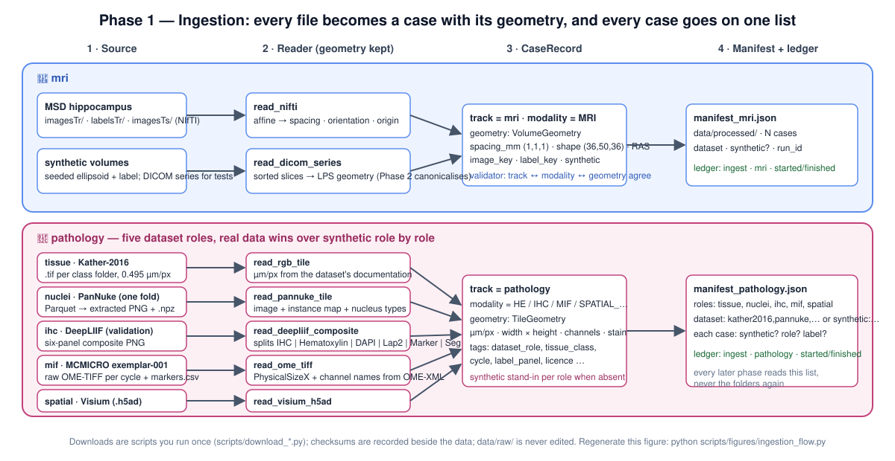

[← README](../../README.md) · [Handbook](../HANDBOOK.md) · [All docs in order](../../README.md#the-tutorial-in-order) · [Glossary](../00-glossary.md) · [Data and models](../08-data-and-models.md)

# Phase 1 — Ingestion: from files on disk to a list of cases with their geometry

**Prerequisites:** [Phase 0c](00c-two-track-refactor.md) finished; both
track requirement files installed (`python -m pip install -r requirements-mri.txt -r requirements-pathology.txt`).
**Learning goal:** after this phase you can explain what ingestion is and
why it is its own stage; read a scan or a slide *with its geometry* and say
what would go wrong without it; generate synthetic stand-ins and know what
they are for; download each public dataset and prove it never changed; and
read the manifest that every later phase depends on.
**Time:** about 2–3 hours hands-on, plus downloads if you choose to do them
(none is required to finish this tutorial). **CPU:** under a minute for
everything synthetic.



---

## Why this phase exists

Every later stage does arithmetic on pixels multiplied by geometry. A
hippocampus volume is *voxel count × voxel size*; a cell density is *cells
÷ tile area*. Get the size note wrong — 1.2 mm read as 1.0, or 40× data
treated as 20× — and every number is wrong by the same factor, and nothing
downstream can tell. So the first stage has one job: **open every file
once, read its geometry, assert it, and write a list.** That list — the
**manifest** — is the pipeline's shopping list. Preprocessing, segmentation
and audit read the manifest; none of them ever scans a folder again.

*Analogy:* before cooking for a hundred people you do not open the fridge a
hundred times. You take inventory once, write it down, and cook from the
list.

Two more reasons this is a separate, documented stage:

- **Provenance.** Public data is downloaded by a script that records a
  checksum beside it. If a result is ever questioned, you can prove the raw
  data is byte-identical to the day it arrived.
- **Offline reproducibility.** Every dataset has a synthetic stand-in, so
  the whole tutorial, every test, and continuous integration run with no
  download at all.

---

## 1. Two tracks, one manifest

Both tracks produce the same thing: `data/processed/manifest_<track>.json`,
a list of `CaseRecord`s. The record carries the case id, where the image
(and reference label, if any) lives, the modality, the geometry, whether
the case is synthetic, and — new in this phase — a `tags` dictionary for
dataset-level facts (tissue class, staining cycle, which composite panel is
the mask, the licence when it matters).

**Do this** — see the shape of the contract before filling it:

```bash
python -c "from imagingagent.manifest import Manifest; import json; print(json.dumps(Manifest.model_json_schema()['properties'], indent=1)[:700])"
```

**Success looks like:** `track`, `dataset`, `created_at`, `synthetic`,
`run_id`, `cases` — the manifest describes itself.

---

## 2. The mri track: volumes

### 2a. Generate synthetic volumes and read one

```bash
imagingagent ingest --track mri --synthetic --limit 5
```

**Success looks like:**

```
track     : mri
dataset   : synthetic (synthetic)
cases     : 5 (5 with reference labels)
geometry  : volume, first case (36, 50, 36) voxels at (1.0, 1.0, 1.0) mm, RAS
manifest  : data/processed/manifest_mri.json
run       : 640ffab080c9
```

Five NIfTI image/label pairs now sit under `data/raw/synthetic_mri/`. Each
is a blurred, noisy, randomly rotated ellipsoid on a darker background —
a hippocampus-sized blob (the test asserts 800–7 000 mm³) that segmentation
code can get right or wrong.

**Now by hand**, in the interpreter (`python`):

```python
from imagingagent.tracks.mri.io import read_nifti
image, geometry = read_nifti("data/raw/synthetic_mri/imagesTr/synthetic_000.nii.gz")
image.shape, image.dtype              # → ((36, 50, 36), dtype('float32'))
geometry.spacing_mm, geometry.orientation, geometry.origin_mm
label, _ = read_nifti("data/raw/synthetic_mri/labelsTr/synthetic_000.nii.gz")
int(label.sum())                      # voxels inside the blob
geometry.volume_mm3(int(label.sum())) # the same, in cubic millimetres — your first biomarker
exit()
```

**Why the affine matters.** A NIfTI file stores voxel values plus a 4×4
*affine* matrix mapping voxel indices to millimetres. `read_nifti` derives
spacing (the length of each of the matrix's first three columns), the
orientation code (which way each axis points in the patient — RAS means
x→Right, y→Anterior, z→Superior) and the origin (the translation column).
Try `geometry.volume_mm3(...)` with spacing `(1, 1, 1.2)` in your head:
the same voxel count gives a 20 % larger volume. That is the whole reason
geometry is asserted in tests.

### 2b. DICOM: many files, one volume

Hospital scanners write **DICOM**: one file per slice, each with rich
metadata, sorted into a *series*. The reader lets SimpleITK find the
series, order the slices by position, and stack them — and reads *only*
geometry tags, never names or dates. There is no patient DICOM in this
project; the synthetic generator writes a DICOM series so the reader is
tested with zero personal data:

```python
python
from imagingagent.tracks.mri.io import read_nifti, read_dicom_series
from imagingagent.tracks.mri.synth import write_synthetic_dicom_series
image, geometry = read_nifti("data/raw/synthetic_mri/imagesTr/synthetic_000.nii.gz")
write_synthetic_dicom_series(image, geometry, "data/interim/dicom_demo")
again, g = read_dicom_series("data/interim/dicom_demo")
again.shape, g.spacing_mm, g.orientation   # → ((36, 50, 36), (1.0, 1.0, 1.0), 'LPS')
exit()
```

**Why does it say LPS, not RAS?** DICOM's patient coordinate system points
+x Left, +y Posterior, +z Superior; NIfTI tools usually use RAS. Same
anatomy, opposite signs on two axes. The reader records what the file
actually says instead of pretending; Phase 2 canonicalises every volume to
one convention. Recording the truth and converting later is safer than
silently assuming.

### 2c. The real dataset (optional now, needed by Phase 3)

```bash
python scripts/download_msd_hippocampus.py
```

**What happens:** a resumable download (≈ 0.4 GB) from the public mirror
hosted for the MONAI project; SHA-256, MD5 and byte count are written to
`data/raw/msd_task04/CHECKSUMS.txt`; the archive is extracted to
`imagesTr/`, `labelsTr/`, `imagesTs/`, `dataset.json` and then deleted.
**Success looks like:**

```
downloading https://msd-for-monai.s3-us-west-2.amazonaws.com/Task04_Hippocampus.tar
     ...
checksums recorded in data/raw/msd_task04/CHECKSUMS.txt
sha256 <64 hex characters>
extracting to data/raw/msd_task04
done: 260 training volumes in data/raw/msd_task04/imagesTr; checksums recorded in ...
```

The exact byte count and hashes are yours to keep; they are the proof. Then:

```bash
imagingagent ingest --track mri          # no flag: real data wins over synthetic
imagingagent manifest --track mri | head -5
```

**Success looks like** `dataset   : msd_task04_hippocampus`, `modality`
column `MRI`, and `synthetic` column `no`. Later, `python
scripts/download_msd_hippocampus.py --verify` re-checks the recorded
checksums (keep the archive with `--keep-archive` if you want to verify
the archive itself rather than the extracted files).

---

## 3. The pathology track: five kinds of image, one list

The slide track covers five dataset **roles**, each with a public dataset
and a synthetic stand-in. The configuration lists them under
`tracks.pathology.datasets` with a `role` each, so code asks "which dataset
plays the *nuclei* role?" rather than hard-coding a name.

| Role | Dataset | What one case is | Reader |
|---|---|---|---|
| tissue | Kather-2016 | one 150 px H&E tile in one of eight tissue classes | `read_rgb_tile` |
| nuclei | PanNuke (one fold) | one 256 px H&E tile with every nucleus outlined and typed | `read_pannuke_tile` |
| ihc | DeepLIIF (validation set) | one IHC tile with co-registered fluorescence panels and a mask | `read_deepliif_composite` |
| mif | MCMICRO exemplar-001 | one four-channel fluorescence tile from one staining cycle | `read_ome_tiff` |
| spatial | 10x Visium sample | one whole H&E image with thousands of expression spots | `read_visium_h5ad` |

### 3a. Generate synthetic stand-ins for every role

```bash
imagingagent ingest --track pathology --synthetic --limit 8
imagingagent manifest --track pathology
```

**Success looks like** (abridged):

```
track     : pathology
dataset   : synthetic:tissue,synthetic:nuclei,synthetic:ihc,synthetic:mif,synthetic:spatial (synthetic)
cases     : 21 (12 with reference labels)
geometry  : tile, first case 256×256 px at 0.25 µm/px, channels ['R', 'G', 'B']
roles     : ihc=2, mif=2, nuclei=8, spatial=1, tissue=8
```

Where did 21 come from? `--limit 8` caps the tiles per role: 8 tissue
tiles, 8 nuclei tiles (the same generator, now with labels), 2 IHC
composites and 2 fluorescence tiles (8 ÷ 4 — they are heavier), and one
Visium-like spot matrix.

### 3b. Read each kind by hand

Open the interpreter and walk the roles. Each reader returns an image and
a `TileGeometry`: microns per pixel, width and height, channel names,
stain — the slide equivalent of the affine.

```python
python
from imagingagent.tracks.pathology.io import read_rgb_tile, read_pannuke_tile, read_ome_tiff, read_deepliif_composite, read_visium_h5ad

# tissue: a plain RGB tile. The file has no scale bar; the caller supplies it.
image, g = read_rgb_tile("data/raw/synthetic_pathology/he/images/synthetic_he_000.png", microns_per_pixel=0.25)
image.shape, g.tile_area_mm2          # → ((256, 256, 3), 0.004096)

# nuclei: the same tile plus its answer key — an instance map and a type per nucleus
image, instances, types = read_pannuke_tile("data/raw/synthetic_pathology/he/images/synthetic_he_000.png",
                                            "data/raw/synthetic_pathology/he/labels/synthetic_he_000.npz")
int(instances.max()), types[:5]       # nucleus count; types 0 Neoplastic … 4 Epithelial
g.area_mm2(int((instances > 0).sum()))  # nuclear area in mm² — pixels × (µm/px)² ÷ 1e6

# mif: channels stacked, names and pixel size read from the OME-XML inside the file
channels, g = read_ome_tiff("data/raw/synthetic_pathology/mif/ome/synthetic_mif_000.ome.tif")
channels.shape, g.channels, g.microns_per_pixel   # → ((4, 256, 256), ['DAPI','CD8','PanCK','Ki67'], 0.25)

# ihc: one wide PNG split into named panels
panels, g = read_deepliif_composite("data/raw/synthetic_pathology/mif/ihc_composite/synthetic_mif_000.png")
list(panels)                          # → ['IHC', 'Hematoxylin', 'DAPI', 'Lap2', 'Marker', 'Seg']

# spatial: an AnnData — a table of spots × genes with coordinates and the H&E image
adata, hires, g = read_visium_h5ad("data/raw/synthetic_pathology/spots/synthetic_visium.h5ad")
adata.shape, hires.shape, round(g.microns_per_pixel, 3)   # → ((576, 6), (600, 600, 3), 0.5)
exit()
```

**Three things to notice.**

- For plain tiles the pixel size comes from the dataset's documentation
  (0.495 µm for Kather-2016, 0.25 µm for PanNuke), because the file cannot
  say. For OME-TIFF it comes from the file. For Visium it is *derived*: a
  Visium spot is 55 µm across, and the file records the spot diameter in
  pixels, so µm/px = 55 ÷ that — recorded honestly as an estimate.
- Every reader converts grey or RGBA to RGB and any depth to 8-bit, so
  every brightfield tile has exactly three channels of the same type.
- A DeepLIIF case is *six images of the same cells*. The IHC panel is what
  a pathologist sees; the fluorescence panels are the truth about which
  cells express the marker. That pairing is why the dataset is in the
  plan: it is the honest test for IHC positivity in Phase 5.

### 3c. Where each dataset lands, and how the roles are filled

```
data/raw/
├── kather2016/Kather_texture_2016_image_tiles_5000/01_TUMOR/…  ← tissue
├── pannuke/fold3-00000-of-00001.parquet                        ← raw download (kept, checksummed)
├── pannuke/extracted/fold3/{images,labels,index.csv}           ← the seeded subset ingestion reads
├── deepliif/DeepLIIF_Validation_Set/*.png                      ← ihc
├── mcmicro_exemplar001/exemplar-001/{markers.csv,raw/*.ome.tiff} ← mif
├── visium_hne/visium_hne_adata.h5ad                            ← spatial
└── synthetic_pathology/{he,mif,spots}/                         ← stand-ins
```

Ingestion checks each role's folder. Real data present → real cases.
Absent → the synthetic stand-in, if the config allows it. A manifest can
therefore mix real and synthetic roles, and **every case says which it
is** (`synthetic: true/false`) and **which role it plays** (`tags.dataset_role`).
`--real` forces real data and refuses if any role is missing; `--synthetic`
forces the generators.

### 3d. The real datasets (optional now; Phase 3 needs nuclei, Phase 6 needs tissue)

Each script is safe to rerun, records checksums, and prints where things
went. Run whichever you want; none blocks the checkpoint.

```bash
python scripts/download_kather2016.py
```
**Success looks like:** `downloading https://zenodo.org/record/53169/files/Kather_texture_2016_image_tiles_5000.zip`, a progress line, `checksums recorded in data/raw/kather2016/CHECKSUMS.txt`, then `done: 5000 tiles under data/raw/kather2016`.

```bash
python scripts/download_pannuke.py
```
**Success looks like:** the fold's Parquet file downloading (≈ 280 MB), `checksums recorded in data/raw/pannuke/CHECKSUMS_fold3.txt`, `extracting 500 tiles (seed 20260904) from fold3-00000-of-00001.parquet ...`, then `done: 500 tiles under data/raw/pannuke/extracted/fold3; licence CC-BY-NC-SA 4.0 (non-commercial)`. **Why a subset?** The whole fold is 2 700 tiles; 500, chosen by a fixed seed, is plenty for Phases 3–7 and keeps every later run fast. The same seed always picks the same tiles, and `index.csv` records which.

```bash
python scripts/download_deepliif.py
```
**Success looks like:** a 161 MB download, then `checksums recorded in data/raw/deepliif/CHECKSUMS_validation.txt` — this script also checks the **publisher's MD5** from the Zenodo record before extracting, so a corrupted or altered download stops with `MD5 mismatch`. Then `done: N composite images under data/raw/deepliif`.

```bash
python scripts/download_mcmicro_exemplar.py
```
**Success looks like:** a 240 MB download, checksums recorded, `done: 3 OME-TIFF cycle files under data/raw/mcmicro_exemplar001`. **What you got:** three staining cycles, each an OME-TIFF holding six four-channel tiles of the same core, plus `markers.csv` naming all twelve channels. They are *raw*: not stitched, not registered across cycles. Ingestion makes each tile of each cycle a case tagged `registered: no`; lining the cycles up is a Phase 2 task, and it reuses the rigid-registration code the mri track uses for scans.

```bash
python scripts/download_visium_sample.py
```
**Success looks like:** a ≈ 0.4–0.5 GB download, checksums recorded, then `done: 2688 spots × 18078 genes; hires image ... ≈ 0.xx µm/px` (spot and gene counts are whatever the file holds — the script prints them). If the direct download fails, the script says so and tells you the one extra library that provides an alternative route.

Then, with any or all of them present:

```bash
imagingagent ingest --track pathology
imagingagent manifest --track pathology | head -12
```

**Success looks like:** `dataset :` naming the real datasets you downloaded
(and `synthetic:<role>` for the rest), and `synthetic` column `no` for the
real roles.

---

## 4. Provenance: the ledger and the checksums

Every `ingest` run writes two lines to `runs/ledger.jsonl` — start and
finish — with the track, the config fingerprint, the package version and
the machine:

```bash
imagingagent ledger list --track pathology
```

And every download leaves a `CHECKSUMS*.txt` beside the data. Together they
answer the two audit questions — *what ran?* and *on which bytes?* — for
every result this project will ever produce.

**Do this:** open one `CHECKSUMS.txt` in your editor. Five lines: sha256,
md5, bytes, url, file. If anyone ever asks whether your data changed, you
recompute and compare. *Analogy:* the wax seal on the evidence bag.

---

## 5. Running it two ways

- **By hand:** the interpreter snippets above — one reader, one file, one
  contract at a time. This is how you debug and how you learn.
- **Automatically:** `imagingagent ingest --track <track>`, which calls the
  same functions, writes the manifest and stamps the ledger. This is how
  every later phase and CI run it.

They call identical code; if they ever disagree, that is a bug.

---

## Checkpoint

- [ ] `imagingagent ingest --track mri --synthetic --limit 5` → 5 cases, RAS, 1 mm spacing
- [ ] `read_dicom_series` on the synthetic series returns the same shape with `LPS`
- [ ] `imagingagent ingest --track pathology --synthetic --limit 8` → 21 cases across five roles
- [ ] each of the five readers ran in the interpreter and you can say where its pixel size came from
- [ ] `imagingagent ledger list --track pathology` shows a finished `ingest` run
- [ ] `pytest -m "mri or pathology"` passes; `pytest` → `77 passed`
- [ ] (optional) at least one real dataset downloaded, its `CHECKSUMS*.txt` present, and `imagingagent ingest` used it without a flag

## What could go wrong

| Symptom | Cause | Fix |
|---|---|---|
| `ImportError: nibabel is required …` / `tifffile is required …` | that track's extras are not installed in this `.venv` | `python -m pip install -r requirements-<track>.txt` (with `.venv` active) |
| `error: Track 'pathology' is disabled` | you are using `configs/mri_only.yaml` | drop `--config`, or use `configs/default.yaml` |
| `No real data for role 'nuclei' … run the matching scripts/download_*.py` | `--real` with a dataset not downloaded | download it, or drop `--real` to allow the synthetic stand-in |
| a download stops with `MD5 mismatch` or `CHECKSUM MISMATCH` | the file is corrupted or the publisher changed it | delete the archive and retry; if it repeats, report it — the mismatch is the safety working |
| `HTTP Error 403` on a download | a corporate proxy or network policy | set `HTTPS_PROXY`, or download the URL printed by the script in a browser and place the file where the script expects it |
| `ValueError: … expected 5 or 6 square panels` | a PNG in `data/raw/deepliif/` that is not a composite | remove stray files; only the dataset's composites belong there |
| PanNuke extraction is slow | decoding hundreds of PNG masks per tile | expected once (a few minutes for 500 tiles); it never runs again |
| Visium direct download fails | the hosting moved | the script says which library provides the fallback; or place the `.h5ad` by hand |
| `imagingagent manifest` shows `spacing / µm-px` as `-` | a case without geometry | it should never happen for these readers; open an issue with the case id |

## What you learned

What ingestion is and why it is a stage of its own; how a NIfTI affine and
a DICOM header become `VolumeGeometry`, and why LPS vs RAS is recorded
rather than assumed; how five kinds of slide data become `TileGeometry`,
and where each one's pixel size comes from; what a manifest is and why
every later stage reads it; what synthetic stand-ins are for; how
checksums and the ledger give every result a provenance trail.

Next: [`02-preprocessing.md`](02-preprocessing.md) — bringing every case
onto common ground: resampling, normalisation, denoising and registration
for volumes; stain separation, normalisation, tissue masking and tiling for
slides — including registering the MCMICRO cycles to each other.

---

## End of phase — git

Phase 1 was committed in three parts (1a, 1b, 1c); this block is for part c.

```bash
git switch develop
git add -A
git commit -m "phase-1c: ingestion tutorial and figure; Phase 1 closed in the handbook, roadmap and README"
git push origin develop develop:beta develop:master
# add --tags only when a release tag was created in this phase

git switch master
git pull --ff-only origin master
git switch develop
```
