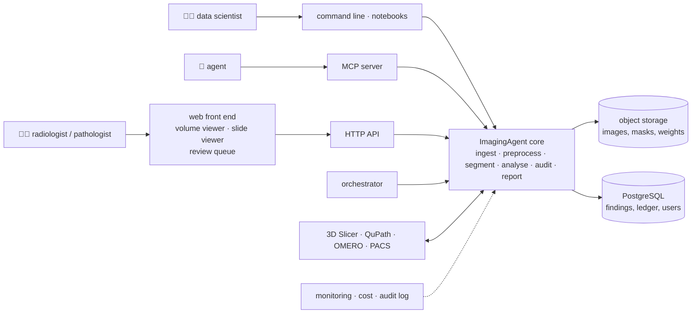

[← README](../README.md) · [Handbook](HANDBOOK.md) · [Repository roadmap](05-roadmap.md) · [Glossary](00-glossary.md)

# 06 — Product and technology roadmap: from this repository to a finished product

**Prerequisites:** [`02-architecture.md`](02-architecture.md), [`05-roadmap.md`](05-roadmap.md).
**Learning goal:** understand what an industrialised, cloud-hosted,
sellable version of ImagingAgent would consist of; be able to explain every
technology in it to someone with no background; and know, for each one,
whether it is needed now, later, optionally or not at all — and what would
change that answer.

## How to read this document

Every technology below answers the same three questions — **Is it
required? Why? What is the concrete benefit, and what is the cost?** — and
receives one verdict:

| Verdict | Meaning |
|---|---|
| **Required now** | part of this repository's build plan; without it the product is not a product |
| **Recommended later** | not needed to run or prove the pipeline; needed to host it for many users or many cases |
| **Optional** | nice to have; adopt only if a concrete user asks |
| **Not needed** | adds cost without benefit at any foreseeable scale, or is the wrong tool |

Each verdict comes with a **trigger**: the observable event that would
change it. The principle throughout: *justify, don't accumulate.* Every
piece of the current repository was designed so the "later" items are
additions, not rewrites — a storage interface, config-driven runs, typed
contracts, a thin command line over reusable functions.

## The finished product in one picture

Everything inside **ImagingAgent core** is this repository. Everything
around it is this document.

---

## A. Product surface — how people use it

### A1. Web front end (React or comparable) with a volume viewer and a whole-slide viewer

**What it is.** A website where a reviewer opens the review queue, scrolls
through flagged cases, sees the MRI slices or the slide region with the
segmentation drawn on top, and clicks accept or flag. *Analogy:* the
difference between a workshop (this repository) and a showroom.
**Required?** Not to prove the pipeline — Streamlit (Phase 11) does that.
Required to serve more than one reviewer at once with logins and history.
**Why.** Pathologists work in slide viewers that pan and zoom across
100,000-pixel images smoothly; radiologists scroll through slices. A
real product needs both, and Streamlit cannot do the slide viewer well.
**Benefit / cost.** Multi-user review, role-based access, a professional
surface for demonstrations. / A TypeScript front end (React), a tile
server for slides (OpenSeadragon-style deep zoom), a volume viewer
(Cornerstone / NiiVue-style), authentication, hosting, and a second
codebase to test.
**Verdict: Recommended later.** **Trigger:** a second regular reviewer, or
the first request for slide panning rather than tile inspection.
*Prepared today by:* contracts that publish JSON Schema; a thin CLI over
functions, so an HTTP API is a mechanical addition.

### A2. HTTP API (FastAPI or comparable)

**What it is.** The same functions the command line calls, exposed over the
web so the front end (or any program) can call them. *Analogy:* a
restaurant kitchen (core) gets a serving hatch.
**Required?** Only once A1 exists. The MCP server already provides
programmatic access for agents.
**Verdict: Recommended later**, together with A1. **Trigger:** A1.

### A3. Integration with 3D Slicer, QuPath, OMERO, Napari, Fiji

**What it is.** Letting people use ImagingAgent from inside the tools they
already live in: a Slicer extension that runs an audit on the open
volume; a QuPath extension that sends the current annotation for audit and
draws the result back; an OMERO connector that reads slides from an image
server. *Analogy:* selling the coffee machine that fits the pods people
already own.
**Required?** No — but **format compatibility is required now** and is in
the plan: importing NIfTI label maps (Slicer, FSL, FreeSurfer) and QuPath
GeoJSON, exporting overlays both can open (Phase 3).
**Benefit / cost.** Adoption where users already are; no workflow change.
/ Each plugin is a small codebase in another ecosystem (Slicer: Python;
QuPath: Groovy/Java; Napari: Python) with its own release cadence.
**Verdict: Formats required now; plugins recommended later.** **Trigger:**
the first user who asks for one — the format work makes each plugin thin.

### A4. Desktop or mobile packaging, app-store distribution

**What it is.** Wrapping the software as an installer or a phone app.
*Analogy:* selling the coffee machine in a supermarket box.
**Required?** No. Users are scientists at workstations with a browser and
a terminal; whole-slide images do not fit on a phone.
**Verdict: Not needed.** **Trigger:** a field or clinical-site deployment
without a browser — none foreseeable.

### A5. Licensing and payments

**What it is.** Keys that unlock features, subscriptions, invoicing.
**Required?** Only when there is something to sell to someone outside the
team. The code is MIT-licensed; a hosted service can be paid.
**Verdict: Optional.** **Trigger:** the first external team willing to pay
for hosting or support. See the pricing sketch in section F.

---

## B. Data platform — where data lives and how it moves

### B1. Object storage (S3-compatible: AWS S3, Azure Blob, MinIO)

**What it is.** Cloud storage for large files, addressed by key rather than
by folder. *Analogy:* a self-storage warehouse with numbered units instead
of a hallway cupboard.
**Required?** Not for one laptop. Required the moment slides arrive: one
whole-slide image is 1–10 GB, a cohort is terabytes.
**Benefit / cost.** Shared, durable, versionable storage; the same key
works from a laptop, a cluster or a web server. / Storage and egress
fees; access control to set up.
**Verdict: Recommended later — interface built now.** The
`Storage` interface in `storage.py` has exactly the six operations an
object store provides; adding `S3Storage` is one class. **Trigger:** the
first real slide cohort. MinIO (open source, runs in a container) is the
free stand-in for development.

### B2. PostgreSQL (relational database)

**What it is.** A database server: tables you can query with SQL, with
users, permissions and concurrent access. *Analogy:* a shared filing
system with an index and a librarian, versus a folder of well-labelled
documents.
**Required?** Not now — findings and the ledger are JSON files with fixed
shapes, which one team can query with a script. Required when several
users write findings at once or when "show me every case flagged for stain
outliers across all studies" must answer in a second.
**Benefit / cost.** Concurrent access, indexing, audit trail, joins across
studies. / A server to run, back up and secure; a migration of the JSON
contracts into tables (mechanical, because the contracts are typed).
**Verdict: Recommended later.** **Trigger:** the first multi-user
deployment, or findings from more than a few thousand cases.

### B3. Databricks, Snowflake

**What they are.** Cloud platforms for analysing very large *tables*
(Snowflake: a data warehouse; Databricks: a lakehouse with Spark and
notebooks). *Analogy:* an industrial kitchen for feeding a stadium.
**Required?** No. ImagingAgent's data are images and masks — files — not
tables. Only the biomarker tables become "big data", and only across
thousands of cases and many studies.
**Verdict: Not needed now.** **Trigger:** cohort-scale biomarker analytics
across studies, with an organisation that already runs one of these
platforms. At that point the biomarker tables (already tabular, typed and
versioned) load into them directly.

### B4. dbt (data build tool)

**What it is.** A tool that turns SQL files into a tested, documented,
version-controlled chain of table transformations. *Analogy:* Git and
unit tests, but for spreadsheets that feed each other.
**Required?** Only once there is a SQL layer (B2) with transformations
worth versioning.
**Verdict: Not needed now.** **Trigger:** B2 adopted and biomarker tables
modelled across studies.

### B5. Orchestrator (Airflow, Dagster, Prefect)

**What it is.** A scheduler that runs pipeline steps in the right order,
retries failures, and shows a dashboard of what ran. *Analogy:* an
alarm clock plus a checklist plus a supervisor.
**Required?** Not for one-command runs on one machine, which the CLI
already gives. Required when new cases arrive nightly and audits must run
unattended.
**Benefit / cost.** Scheduling, retries, lineage, alerts. / Another
service with its own database; a learning curve.
**Verdict: Recommended later.** **Trigger:** scheduled batch audits on
incoming data. Because every step is already a function with typed inputs
and outputs, wrapping steps as orchestrator tasks is mechanical. Dagster is
the likely pick (asset-oriented, matches "a mask is produced from a
volume"); Airflow if the host organisation already runs it.

### B6. Data and model versioning (DVC, or Git LFS, or MLflow)

**What it is.** Version control for large files and trained models — which
weights produced which result. *Analogy:* Git for things too big for Git.
**Required?** Not yet: seeds are fixed, datasets are checksummed, and the
ledger records the config fingerprint and package version with every run.
**Verdict: Recommended later.** **Trigger:** more than one trained model in
circulation, or a dataset that changes over time.

---

## C. AI components

### C1. Language-model report writer

**What it is.** Turning structured findings into readable prose. *Analogy:*
a scribe who may only write down what the instruments show.
**Required?** Yes, minimally — grounded plain-language reporting is part
of the product's purpose. **Constraint:** the writer never sees images,
never invents a number, and works with a template backend by default so
the pipeline runs with no account or key.
**Verdict: Required now (Phase 11).** **Trigger for a hosted model
backend:** a user who wants richer prose and has a provider account; it is
switched on by environment variable.

### C2. Retrieval over reports and literature (RAG)

**What it is.** Letting the report writer or an agent look things up in
past reports and cited papers before answering. *Analogy:* an open-book
exam instead of a closed-book one.
**Required?** No — there are no past reports yet.
**Verdict: Recommended later.** **Trigger:** a corpus of a few hundred
reports, or a request such as "what did we find on similar cases?"

### C3. MCP server — exposing ImagingAgent to agents

**What it is.** A standard interface (Model Context Protocol) so any agent
software can call ImagingAgent's tools. *Analogy:* a USB port.
**Required?** Yes — it is the product's identity: analyses that an agent
can *run*, not merely describe.
**Constraints:** every tool is schema-validated, read-only by default, and
logs to the ledger; write actions require explicit configuration.
**Verdict: Required now (Phase 11).**

### C4. MCP client — ImagingAgent calling other tools

**What it is.** The reverse: ImagingAgent asking a PACS server for a scan
or a literature server for a citation.
**Verdict: Optional.** **Trigger:** a second MCP server in the environment
worth calling.

### C5. Knowledge graph and clinical ontologies (SNOMED CT, RadLex, Cell Ontology, UBERON)

**What they are.** An **ontology** is an agreed vocabulary with
relationships: RadLex names anatomy and imaging findings; SNOMED CT names
clinical concepts; Cell Ontology names cell types; UBERON names tissues.
A **knowledge graph** links findings to those concepts and to each other.
*Analogy:* a family tree for concepts, so "hippocampal atrophy" from one
system and "reduced hippocampal volume" from another are recognised as
the same thing.
**Required?** No — but findings are already structured (typed, named,
with units), which is the hard part. Coding each finding to an ontology
identifier is an additional field.
**Benefit / cost.** Interoperability with hospital and research systems;
queries such as "all findings involving immune cells in tumour stroma".
/ SNOMED CT licensing (national licences; free in many countries for
research); mapping effort; a graph store if queries grow.
**Verdict: Recommended later.** **Trigger:** integration with a system
that speaks these vocabularies, or a cross-study query need.

### C6. Foundation models — gated and large

Covered in [`05-roadmap.md`](05-roadmap.md): the embedding contract
accepts any encoder; gated weights and GPU-sized models are added when
access and hardware allow. **Verdict: Recommended later.** **Trigger:**
access granted plus the free-GPU path.

### C7. Virtual staining and image synthesis (generative models)

**What it is.** Models that predict one stain from another (IHC from H&E,
mIF from IHC) or synthesise realistic training images. *Analogy:* a
painter who can render a scene in a different medium.
**Required?** No; this release's generative components are stain/intensity
augmentation and the report writer. Virtual staining needs a GPU to train.
**Verdict: Recommended later.** **Trigger:** GPU availability; the paired
DeepLIIF data are already ingested for it.

---

## D. Cloud and operations

### D1. Containers (Docker, Podman)

**What it is.** A packaged environment with the code and every dependency,
identical on any machine. *Analogy:* a shipping container.
**Required?** Yes for the product; scheduled as Phase 12 of this
repository (Podman-compatible because RHEL 8 ships Podman).
**Benefit / cost.** Identical runs on laptops, RHEL 8 VMs, clusters and
cloud. / An image to rebuild when dependencies change; CPU-only images
stay small, GPU images are large.
**Verdict: Required now (Phase 12).**

### D2. Kubernetes vs serverless

**What they are.** Kubernetes runs many containers across many machines
with scaling and self-healing; serverless runs a function on demand and
bills per second. *Analogy:* running a fleet of delivery vans versus
calling a taxi when needed.
**Required?** No. One container on one VM serves a team. Slide processing
runs for minutes and needs local disk, which fits serverless badly.
**Verdict: Not needed now.** **Trigger:** a multi-tenant hosted service.
When it comes, a batch worker per audit job on Kubernetes fits better than
serverless.

### D3. GPU and HPC scheduling

**What it is.** Running heavy steps on a GPU machine or a cluster queue
(SLURM). *Analogy:* borrowing the racing car for the one leg that needs
it.
**Required?** Not for this repository, which is CPU-first by design. The
`--device` switch, the free-GPU notebook and an HPC note (Phase 12) cover
the path.
**Verdict: Recommended later.** **Trigger:** whole-slide inference or
large 3D models.

### D4. CI/CD

**What it is.** Continuous integration (tests on every push) and
continuous delivery (automatic builds and deployments from `master`).
**Verdict: CI required now (built); CD recommended later.** **Trigger for
CD:** a hosted deployment to deliver to.

### D5. Monitoring, logging, audit log

**What it is.** Knowing what the system is doing and did: uptime, run
durations, errors, who did what. *Analogy:* the dashboard and the black
box.
**Required?** The run ledger *is* the audit log today. Uptime and error
monitoring matter only for a hosted service.
**Verdict: Recommended later.** **Trigger:** hosted deployment.

### D6. Cost model

**What it is.** Knowing what a case costs to process and store. For
orientation: CPU processing of one MRI case is seconds; one whole slide is
minutes of CPU or seconds of GPU; storage is dominated by slides (1–10 GB
each). A hosted service would price per case or per slide accordingly.
**Verdict: Recommended later** (a spreadsheet, not a technology).
**Trigger:** first hosting bill.

---

## E. Security and regulatory constraints

These are **required now as constraints on design**, not as technologies,
because retrofitting them is expensive and designing for them is cheap.

| Constraint | What it means for ImagingAgent | Status |
|---|---|---|
| **GDPR** (EU data protection) | no personal data in logs, ledger, reports or file names; data minimisation; deletability | designed in: case ids are opaque; the ledger records settings, not people |
| **HIPAA** (US health-data rules) | encryption at rest and in transit, access control, audit trails, for any hosted deployment holding patient data | the ledger is the audit-trail seed; encryption and access control are B1/B2/D-level items when hosting |
| **De-identification** | only de-identified or public data are used; DICOM headers can carry names — the DICOM reader keeps geometry and drops identifying tags | Phase 1 |
| **Medical-device software** (EU MDR / IVDR, FDA SaMD, IEC 62304) | software that informs diagnosis or treatment is regulated; this project is **research use only** and says so in the README and every report; the audit layer assists a qualified reviewer and never replaces one | stated now; a regulated product would need a quality-management system, a documented lifecycle and clinical validation — a company-level decision, far beyond this roadmap |
| **Dataset licences** | PanNuke is non-commercial; results derived from it inherit that; a commercial product would retrain on permissively licensed or proprietary data | tracked in [`08-data-and-models.md`](08-data-and-models.md) |
| **Model licences** | Phikon is non-commercial; PLIP is OpenRAIL; InstanSeg models carry their own terms | same |

---

## F. Discoverability and go-to-market

### F1. SEO, AEO, GEO for the product site and docs

**What they are.** **SEO** (search-engine optimisation): writing pages so
search engines rank them — clear titles, one topic per page, plain
language. **AEO** (answer-engine optimisation): structuring content so
that question-answering tools quote it — short direct answers, glossary
definitions, FAQs. **GEO** (generative-engine optimisation): making
content easy for generative assistants to summarise and cite — consistent
terminology, explicit claims with sources, machine-readable structure.
*Analogy:* SEO puts your shop on the high street; AEO puts your product
in the reference book; GEO makes sure the tour guide describes it
accurately.
**Required?** No. This repository's README and glossary already answer the
questions people search for, in plain language, one concept per section.
**Verdict: Optional.** **Trigger:** a product site.

### F2. Pricing and packaging sketch

For orientation only; there is no product to sell yet.

| Tier | Who | What | Price basis |
|---|---|---|---|
| Open source | anyone | this repository, MIT | free |
| Hosted team | one research group | web front end, object storage, review queue, support | per seat per month |
| Enterprise | pharma / hospital | private deployment, integrations (PACS, OMERO), SSO, audit-log retention, SLA | per site per year |
| Research use only | all tiers | none of the above is a medical device | — |

**Verdict: Optional.** **Trigger:** first external interest.

---

## G. The end-to-end product pipeline, and what already exists

| Stage | What the finished product does | Exists today (Phase 0) | Arrives with |
|---|---|---|---|
| **Ingest** | pull cases from object storage, PACS or OMERO; read any format with geometry; de-identify | config, storage interface, case contract | Phase 1 (readers, downloads, synthetic), B1 (object storage), A3 (OMERO), later (PACS) |
| **Segment or import** | own models or imported masks, on CPU or GPU, scheduled | segmentation and report contracts | Phase 3, D3, B5 |
| **Audit** | reference-free trust scores and a review queue with a budget | `AuditReport`, `Finding`, `Verdict` contracts | Phase 9 |
| **Report** | grounded per-case reports; benchmark reports; ontology-coded findings | contracts publish JSON Schema | Phases 10–11, C5 |
| **Serve** | web front end, HTTP API, MCP server, integrations | CLI as thin skin over functions | Phase 11 (MCP, Streamlit), A1/A2 (web), A3 (plugins) |
| **Operate** | containers, monitoring, cost, audit log, backups | run ledger, 3-OS CI | Phase 12 (container), D5, B2 |

The foundation column is what makes the "arrives with" column a list of
additions. Nothing in it needs to be rewritten to reach the last column.

## Sequencing summary

1. **This repository (Phases 0–12):** everything marked *Required now*.
2. **First hosted deployment:** B1 object storage → B2 PostgreSQL → A2
   HTTP API → A1 web front end → D5 monitoring → D4 CD.
3. **Scale and integration:** B5 orchestrator → A3 plugins → C5 ontologies
   → D3 GPU/HPC → D2 Kubernetes.
4. **Only on demand:** B3/B4 warehouse and dbt, C2 retrieval, C4 MCP
   client, C7 virtual staining, A5/F2 commercial, F1 discoverability.

## How this document is maintained

Re-read at every release tag. A verdict changes only when its trigger has
observably fired; the change is recorded in `CHANGELOG.md` and in an
architecture decision record under [`adr/`](adr/README.md).
