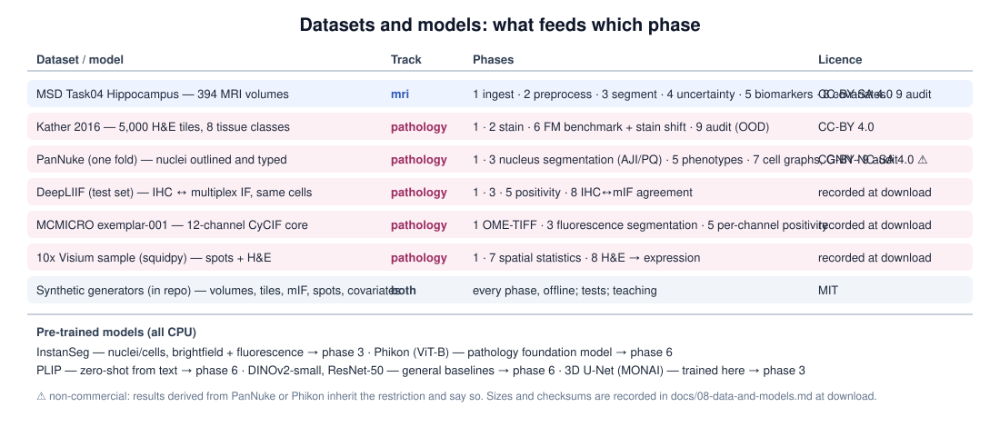

[← README](../README.md) · [Handbook](HANDBOOK.md) · [Roadmap](05-roadmap.md) · [Glossary](00-glossary.md)

# 08 — Data and models: every dataset and pre-trained model, and how to get them

**Prerequisites:** [`02-architecture.md`](02-architecture.md).
**Learning goal:** know what data the platform uses, where it comes from,
what it may be used for, how big it is, how to download it, and what to do
when you cannot — for both tracks.

**Status note.** Download scripts (`scripts/download_<name>.py`) and
synthetic generators (`scripts/synth_<name>.py`) arrive with Phase 1;
this page fixes their names, sources and rules now. Sizes marked *recorded
at download* are filled in, with checksums, when Phase 1 first fetches
each dataset. Nothing here is guessed: each entry states what was verified
and when.

## Rules that apply to every dataset

1. **Raw downloads are never edited.** They land in `data/raw/<name>/`
   and stay byte-identical; a checksum file beside them proves it.
2. **Every dataset has a synthetic stand-in.** `--synthetic` on any
   command generates a small look-alike so every command runs offline and
   every test runs in seconds. Synthetic data is labelled `synthetic: true`
   in every contract and file name.
3. **Licences travel with results.** A result derived from a
   non-commercial dataset is itself non-commercial; the benchmark report
   states this per table.
4. **No personal data.** Every dataset below is public and de-identified.
   DICOM readers keep geometry and drop identifying tags.
5. **Budget.** The whole project stays under 6 GB on disk and no single
   download exceeds 2 GB.

## Disk budget at a glance

| Item | Track | Expected size | Verified |
|---|---|---|---|
| MSD Task04 Hippocampus | mri | ≈ 0.4 GB | structure and licence verified; size *recorded at download* |
| Kather 2016 CRC textures | pathology | hundreds of MB | licence, tile count and resolution verified; size *recorded at download* |
| PanNuke (one fold) | pathology | ≈ 0.7 GB (largest single download) | licence and structure verified; size *recorded at download* |
| DeepLIIF test set | pathology | hundreds of MB | content verified; size *recorded at download* |
| MCMICRO exemplar-001 | pathology | small | content verified; URL and size *recorded at download* |
| 10x Visium sample (squidpy) | pathology | ≈ 0.5 GB | *recorded at download* |
| Model weights (all) | both | ≈ 1.5 GB | per-model sizes below |
| **Total** | | **≈ 4 GB** | under the 6 GB budget |

---

## mri track

### Medical Segmentation Decathlon — Task 04, Hippocampus

- **What:** 394 T1-weighted MRI volumes cropped around the hippocampus,
  each with an expert label map of two subregions (anterior, posterior),
  in NIfTI format with the standard MSD folder layout (`imagesTr/`,
  `labelsTr/`, `imagesTs/`, `dataset.json`).
- **Why this one:** volumes are roughly 35 × 50 × 35 voxels, so
  preprocessing takes seconds and a 3D U-Net trains on a laptop CPU in
  minutes; the hippocampus is small and low-contrast, so real failure
  cases exist for the audit layer to find.
- **Source:** <http://medicaldecathlon.com/> (also mirrored on the AWS
  Registry of Open Data). **Licence:** CC-BY-SA 4.0.
- **Citation:** Antonelli M. et al. *The Medical Segmentation Decathlon.*
  Nature Communications 13, 4128 (2022).
- **Download:** `python scripts/download_msd_hippocampus.py` → `data/raw/msd_task04/` *(Phase 1)*.
- **Synthetic stand-in:** `scripts/synth_volume.py` — seeded 3D volumes
  with a blurred, noisy ellipsoid "hippocampus" and a matching label map,
  plus a synthetic DICOM series for the DICOM reader tests.
- **Honesty note:** two hemispheres per volume are labelled; v0.1.0 treats
  the union as one structure and the subregions are the first extension.

### CT via MSD Task 09, Spleen *(config switch, deferred)*

Larger volumes (≈ 1.5 GB); documented as a one-line configuration change
with the free-GPU notebook path recommended. Same source and licence as
above.

---

## pathology track

### Kather 2016 — colorectal cancer histology textures

- **What:** 5,000 H&E tiles of 150 × 150 px at 0.495 µm/px (20×), eight
  tissue classes (tumour epithelium, simple stroma, complex stroma, immune
  cells, debris, normal mucosa, adipose, background), 625 tiles per class.
- **Why:** small, permissively licensed, balanced — ideal for tissue
  classification, linear probes over foundation-model embeddings, and
  stain-shift robustness tests (the tiles come from ten anonymised
  patients, which also gives a patient-level split).
- **Source:** Zenodo record 53169. **Licence:** CC-BY 4.0.
- **Citation:** Kather J.N. et al. *Multi-class texture analysis in
  colorectal cancer histology.* Scientific Reports 6, 27988 (2016).
- **Download:** `python scripts/download_kather2016.py` → `data/raw/kather2016/`.
- **Synthetic stand-in:** `scripts/synth_he_tiles.py` — seeded tiles with
  drawn "nuclei" and class-specific textures, eight classes.

### PanNuke — nucleus instances and types *(one fold)*

- **What:** 7,901 H&E tiles of 256 × 256 px at 0.25 µm/px (40×) from 19
  tissue types, every nucleus outlined (instance mask) and typed
  (neoplastic, inflammatory, connective, dead, non-neoplastic epithelial).
  Distributed as three folds of NumPy arrays.
- **Why:** the reference for nucleus segmentation (Dice, AJI, PQ) and the
  training set for the nucleus-type classifier; also the source of cell
  graphs in Phase 7. One fold is enough and keeps the download under 1 GB.
- **Source:** Tissue Image Analytics Centre, University of Warwick
  (original), with a Hugging Face mirror (`RationAI/PanNuke`) that allows
  downloading one fold. **Licence:** CC-BY-NC-SA 4.0 — **non-commercial;
  results derived from it inherit this.**
- **Citation:** Gamper J. et al. *PanNuke Dataset Extension, Insights and
  Baselines.* arXiv:2003.10778 (2020).
- **Download:** `python scripts/download_pannuke.py --fold 3` → `data/raw/pannuke/`.
- **Synthetic stand-in:** the H&E generator above also emits instance
  masks and types.

### DeepLIIF — paired IHC and multiplex immunofluorescence *(test set)*

- **What:** co-registered image sets of the same tissue: an IHC image
  (Ki67, brown DAB with blue counterstain), the matching multiplex IF
  channels (DAPI, LAP2β, Ki67), a hematoxylin channel, and segmentation
  masks; 512 × 512 px tiles.
- **Why:** the only public dataset pairing brightfield IHC with
  fluorescence of the *same* cells — the honest test for IHC positivity
  (compare to the fluorescence channel) and the ingredient for virtual
  staining later. The test set is the small download; the training set
  is optional.
- **Source:** Zenodo record 4751737. **Licence:** *recorded at download*
  from the record page.
- **Citation:** Ghahremani P. et al. *Deep learning-inferred multiplex
  immunofluorescence for immunohistochemical image quantification.* Nature
  Machine Intelligence 4, 401–412 (2022).
- **Download:** `python scripts/download_deepliif.py --split test` → `data/raw/deepliif/`.
- **Synthetic stand-in:** `scripts/synth_mif_tiles.py` emits a DAB-like
  RGB tile and matching fluorescence channels from one set of drawn cells.

### MCMICRO exemplar-001 — multiplex immunofluorescence (CyCIF)

- **What:** one tissue-microarray core imaged by cyclic immunofluorescence
  in three cycles, 12 channels (including DAPI), as OME-TIFF — the
  project's "minimal reproducible example".
- **Why:** a real multi-channel image with real cycle-to-cycle
  registration, small enough to process on a laptop: tests the OME-TIFF
  reader, channel-invariant cell segmentation and per-channel positivity.
- **Source:** Laboratory of Systems Pharmacology (labsyspharm) MCMICRO
  exemplars. **Licence:** *recorded at download.* **Access:** direct
  download URL *recorded at download*; no Nextflow needed.
- **Citation:** Schapiro D. et al. *MCMICRO: a scalable, modular
  image-processing pipeline for multiplexed tissue imaging.* Nature Methods
  19, 311–315 (2022).
- **Download:** `python scripts/download_mcmicro_exemplar.py` → `data/raw/mcmicro_exemplar001/`.
- **Synthetic stand-in:** the multi-channel generator above.

### 10x Visium — spatial transcriptomics with H&E (via squidpy)

- **What:** a 10x Visium sample (mouse brain) shipped by the squidpy
  library: a spot-by-gene expression matrix with spot coordinates and the
  matching H&E image.
- **Why:** the image-to-expression multi-modal experiment in Phase 8
  (predict expression clusters from H&E embeddings) with a loader that
  works identically on all three operating systems.
- **Source:** `squidpy.datasets.visium_hne_adata()` (data hosted by the
  squidpy project; original data from 10x Genomics). **Licence:** *recorded
  at download* (10x public datasets are released for research use).
- **Citation:** Palla G. et al. *Squidpy: a scalable framework for spatial
  omics analysis.* Nature Methods 19, 171–178 (2022).
- **Download:** `python scripts/download_visium_sample.py` → `data/raw/visium_hne/`.
- **Synthetic stand-in:** `scripts/synth_spots.py` — a seeded spot grid
  with a handful of "genes" whose expression follows drawn tissue regions
  on a synthetic H&E image.

---

## Case-level covariates (both tracks) — simulated

The public imaging datasets carry no clinical metadata. For stratification
and endpoint demonstrations (Phase 8), `scripts/synth_covariates.py`
generates a seeded table (case id, age band, site, scanner or lab, arm)
with a header line stating it is simulated. It exists to demonstrate the
*join and the statistics*, not to claim any biology.

---

## Pre-trained models

All run on CPU. Weights are downloaded once into `models/` (or the library
cache) and never committed.

| Model | Track | What it is | Size | Licence | Used in |
|---|---|---|---|---|---|
| **InstanSeg** `brightfield_nuclei`, `fluorescence_nuclei_and_cells` | pathology | nucleus/cell instance segmentation (TorchScript, PyTorch); the fluorescence model is channel-invariant | a few MB each | code Apache-2.0; model terms on their release page, *recorded at download* | Phase 3 |
| **Phikon** (ViT-B, Owkin) | pathology | pathology foundation model, self-supervised on 40 M TCGA tiles; ungated | ≈ 340 MB | Owkin non-commercial | Phase 6 (default FM) |
| **Phikon-v2** (ViT-L) | pathology | larger successor; documented config switch, slower on CPU | 1.2 GB | Owkin non-commercial | optional |
| **Hibou-B** (ViT-B, HistAI) | pathology | Apache-2.0 pathology FM behind a click-through gate (free account) | ≈ 350 MB | Apache-2.0 | optional second FM |
| **PLIP** (CLIP ViT-B/32) | pathology | pathology vision-language model; zero-shot from text prompts | ≈ 600 MB | OpenRAIL | Phase 6 |
| **DINOv2-small** (Meta) | pathology | general-domain self-supervised baseline | ≈ 90 MB | Apache-2.0 | Phase 6 (baseline) |
| **ResNet-50** (torchvision, ImageNet) | pathology | supervised general-domain baseline | ≈ 100 MB | BSD | Phase 6 (baseline) |
| **3D U-Net** (MONAI) | mri | trained *in this repository* from scratch | ≈ 20 MB | this repo, MIT | Phase 3 |
| Gated FMs (UNI, CONCH, Virchow, Prov-GigaPath, OpenMidnight, H-optimus-0) | pathology | see roadmap | > 1 GB | various, gated | deferred |

**Citations.** Goldsborough T. et al., *InstanSeg* (arXiv 2024). Filiot A.
et al., *Scaling self-supervised learning for histopathology with masked
image modeling* (medRxiv 2023) — Phikon. Huang Z. et al., *A visual–language
foundation model for pathology image analysis using medical Twitter*,
Nature Medicine 29, 2307–2316 (2023) — PLIP. Oquab M. et al., *DINOv2*
(arXiv 2023). He K. et al., *Deep residual learning* (CVPR 2016). Cardoso
M.J. et al., *MONAI* (arXiv 2022).

## When a download fails

Use the synthetic stand-in (`--synthetic`) and continue; every phase's
checkpoint is reachable that way. Then report the failure as an issue with
the script name, the full error, and your operating system — sources do
move, and the download scripts are kept current.
