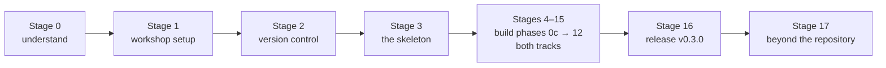

[← README](../README.md) · [Glossary](00-glossary.md) · [Architecture](02-architecture.md) · [Roadmap](05-roadmap.md) · [Product roadmap](06-product-and-technology-roadmap.md)

# The ImagingAgent Handbook — from day 0 to the finished product

**Handbook version:** 0.1 · **Last updated:** 2026-09-06 · **Repository state it describes:** Phase 0 built, Phase 0b in progress.

**This is the one document to read first and to come back to.** It walks
the whole journey — understanding the project, setting up a blank machine,
building every phase, releasing, and what lies beyond the repository — in
order, explaining *why* at every step, and linking to the specialised
document that holds the detail. You should never have to hunt through the
repository to find out what to do next; if you do, that is a defect in
this handbook — open an issue.

**Who this is for.** Someone with no background in medical imaging,
pathology, machine learning, Python, Git or the command line, who wants to
end up able to build, run, explain and extend this platform. Every term
is defined in [`00-glossary.md`](00-glossary.md); keep it open in a second
tab.

**How to use it.** Stages are numbered and sequential. Each stage says:
what you are about to do, why it exists, exactly which document to open,
how long it takes, and how you know you are done (the checkpoint). Do the
checkpoint before moving on. The handbook is updated at the end of every
phase — the *status* column below is the truth about the repository on the
date at the top.

---

## The journey at a glance



| Stage | What | Time | Status |
|---|---|---|---|
| 0 | Understand what you are building and why | 1 h reading | ✅ docs exist |
| 1 | Set up your workshop (once per machine) | 45 min | ✅ guides exist |
| 2 | Put the code under version control | 30 min | ✅ guide exists |
| 3 | Walk through the skeleton (Phase 0) | 1.5 h | ✅ built |
| 4 | Two-track refactor (Phase 0c) | 1–2 h | ⏳ next |
| 5 | Ingestion (Phase 1) | 2–3 h + downloads | ⏳ |
| 6 | Preprocessing (Phase 2) | 2 h | ⏳ |
| 7 | Segmentation (Phase 3) → **v0.1.0** | 3–4 h | ⏳ |
| 8 | Uncertainty & repeatability (Phase 4, mri) | 2–3 h | ⏳ |
| 9 | Features & biomarkers (Phase 5) | 2 h | ⏳ |
| 10 | Foundation-model benchmark (Phase 6, pathology) | 2–3 h | ⏳ |
| 11 | Spatial & graph learning (Phase 7, pathology) | 2–3 h | ⏳ |
| 12 | Multi-modal (Phase 8) → **v0.2.0** | 2–3 h | ⏳ |
| 13 | Audit & triage (Phase 9) | 2–3 h | ⏳ |
| 14 | Benchmark, report, talk (Phase 10) | 2 h | ⏳ |
| 15 | Serving: reports, MCP, review UI (Phase 11) | 3 h | ⏳ |
| 16 | Reproducibility & release (Phase 12) → **v0.3.0** | 2 h | ⏳ |
| 17 | Beyond the repository: the product | reading | ✅ plan exists |

Times are hands-on estimates for a beginner following the tutorials, not
CPU time (CPU budgets are in [`05-roadmap.md`](05-roadmap.md)). At roughly
4–5 hours a week, the whole build is a season's work, and every stage ends
at a natural stopping point with everything committed.

---

## Stage 0 — Understand what you are building and why

**What.** Read three documents, in this order.

1. [`README.md`](../README.md) — start with *"What is a segmentation?"*:
   two scenes, a neurologist's brain scan and an oncology researcher's
   slide, that explain in ten sentences what this whole platform measures.
   Then *"The problem this project tackles"*.
2. [`02-architecture.md`](02-architecture.md) — every box in the diagram,
   why it exists, and the two rules (data flows one way; both tracks stay
   symmetric).
3. [`05-roadmap.md`](05-roadmap.md) — the phase plan you are about to
   follow, and what is deliberately deferred.

**Why.** Everything you will type later makes more sense if you can say,
in one sentence, what the platform is for: *turning images into biomarkers
you can trust, and telling a human which ones to check.* Building without
that sentence is copying; building with it is learning.

**Checkpoint.** You can explain to a friend, without notes: what a
segmentation is; why an average score hides failures; what the two tracks
are; what the audit layer does.

---

## Stage 1 — Set up your workshop (once per machine)

**What.** Open the setup guide for your operating system and follow it
from Step 1 to the end:
[Windows](01-setup-windows.md) · [macOS](01-setup-macos.md) · [RHEL 8](01-setup-rhel8.md).

**Why.** You are installing five things — Python 3.11, Git, an editor, a
GitHub account, and a private Python environment for this project — and
proving each one works before adding the next. Setup is done *once*;
everything after it is a short repeatable loop.

**Platform note.** The three guides differ only where the operating
systems do (how to install Python, how to activate the environment). The
project itself is platform-independent: forward-slash paths, `pathlib`,
no shell tricks — and continuous integration runs the tests on Windows,
macOS and Linux at every push, so a difference cannot hide.

**Checkpoint.** Your terminal prompt shows `(.venv)`,
`imagingagent doctor --config configs/default.yaml` ends with
`result       : healthy`, and `pytest` ends with `31 passed`.

---

## Stage 2 — Put the code under version control

**What.** Read [`03-git-workflow.md`](03-git-workflow.md). If you are
creating the repository (not cloning it), do Part A. Either way, learn
Part B: the end-of-phase ritual you will repeat at every stage below.

**Why.** Git is the save-game system; the three branches — `master`
(released), `beta` (finished phases), `develop` (daily work) — let a
stranger find a working version while you build the next phase.

**The end-of-phase ritual**, used at the end of every stage from here on
(each stage names its commit message):

```bash
git switch develop
git add -A
git commit -m "<the stage's commit message>"
git push origin develop develop:beta develop:master
# add --tags only when a release tag was created in this phase

git switch master
git pull --ff-only origin master
git switch develop
```

**Checkpoint.** `git branch -a` lists `master`, `beta`, `develop` locally
and on `origin`; the Actions tab on GitHub shows green.

---

## Stage 3 — Walk through the skeleton (Phase 0) ✅

**What.** Follow [`04-phase-tutorials/00-phase-0-skeleton.md`](04-phase-tutorials/00-phase-0-skeleton.md):
a guided tour of every file with small hands-on experiments — break the
config on purpose, try to escape the storage root, read the ledger.

**Why.** This is the foundation every later phase stands on: typed
configuration, a storage interface, data contracts, a run ledger, a thin
command line, tests and three-OS CI. Understanding it now means every
later phase is "add a module, add a test, add a tutorial" rather than
"learn a new architecture".

**Checkpoint.** The tutorial's checkpoint list, all ticked.
**Commit message:** already committed (`phase-0…`, `phase-0b…`).

---

## Stage 4 — Two-track refactor (Phase 0c) ⏳

**What.** Follow `04-phase-tutorials/00c-two-track-refactor.md` *(arrives
with the phase)*.

**Why.** The skeleton was written for one modality. This phase makes
"which kind of image?" a first-class idea: a `tracks:` block in the
configuration, two geometry contracts (`VolumeGeometry` for scans,
`TileGeometry` for slides), a modality registry, and `--track` on every
command. Every existing test is kept and updated in place — none deleted —
so you see exactly what changed and why.

**Checkpoint.** `imagingagent doctor` lists optional libraries under
*mri*, *pathology* and *serve* headings; all tests pass.
**Commit message:** `phase-0c: two-track configuration, geometry contracts, modality registry, --track on every command`.

---

## Stage 5 — Ingestion (Phase 1) ⏳

**What.** Follow `04-phase-tutorials/01-ingestion.md`. Download the
public datasets ([`08-data-and-models.md`](08-data-and-models.md) lists
every one with size, licence and command) or generate the synthetic
stand-ins; read them with their geometry; build the case manifest.

**Why.** Everything downstream is arithmetic on pixels multiplied by
geometry. Get the geometry wrong — voxel spacing for a scan, microns per
pixel for a slide — and every biomarker is wrong by a constant factor
that no later check can see. This phase reads images *and* asserts their
geometry in tests. The synthetic generators exist so every command runs
with no download and tests take seconds.

**Checkpoint.** `imagingagent ingest --track mri` and `--track pathology`
each write a manifest; `imagingagent ingest --track mri --synthetic`
works offline.
**Commit message:** `phase-1: ingestion for both tracks — readers with geometry, downloads, synthetic generators, manifest`.

---

## Stage 6 — Preprocessing (Phase 2) ⏳

**What.** Follow `04-phase-tutorials/02-preprocessing.md`.

**Why.** Images from different scanners or labs are not comparable until
brought onto common ground: same voxel size and intensity range for
scans; same stain appearance for slides. You will *see* the difference in
before/after figures. Augmentation (deliberately varied copies) is built
here too, because robustness testing later needs it.

**Checkpoint.** Preprocessed volumes and normalised tiles in
`data/interim/`, with the before/after figures regenerated by script.
**Commit message:** `phase-2: preprocessing for both tracks — resampling, normalisation, registration; stain separation, Macenko, tiling`.

---

## Stage 7 — Segmentation (Phase 3) → v0.1.0 ⏳

**What.** Follow `04-phase-tutorials/03-segmentation.md`: a classical
method, a learned model (3D U-Net on CPU in minutes; InstanSeg
pre-trained), and the import door for label maps from other tools;
metrics and per-case failure lists.

**Why.** Three doors into one contract, because in practice segmentations
arrive from many tools and the real question is whether to trust them.
The learned model must beat the classical one to earn its complexity —
and the tutorial shows how to read the result when it does not.

**Checkpoint.** Metrics tables for both tracks in `runs/`, each line
traceable to the ledger.
**Commit message:** `phase-3: segmentation for both tracks — classical, learned, imported; surface and instance metrics` and then the release
steps in [`03-git-workflow.md`](03-git-workflow.md) Part C for `v0.1.0`
(push with `--tags`).

---

## Stage 8 — Uncertainty & repeatability (Phase 4, mri) ⏳

**What.** Follow `04-phase-tutorials/04-uncertainty-repeatability.md`.

**Why.** A model's confidence is worth nothing until checked: this phase
measures per-case disagreement (test-time augmentation, Monte Carlo
dropout), checks it predicts real error (calibration), then asks the
question a clinical team asks — *how much does the biomarker move when
nothing real changed?* — and reports the minimum detectable difference.
Pathology's equivalent signals arrive in Stages 10 and 13.

**Checkpoint.** A calibration figure and a repeatability table.
**Commit message:** `phase-4: uncertainty, calibration and repeatability for the mri track`.

---

## Stage 9 — Features & biomarkers (Phase 5) ⏳

**What.** Follow `04-phase-tutorials/05-features-biomarkers.md`.

**Why.** This is where outlines become numbers: volume and shape for
scans; cell morphology, cell types and marker positivity for slides;
densities and compositions per tile; all with confidence intervals, in
one tabular contract both tracks share.

**Checkpoint.** `data/processed/biomarkers_<track>.csv` for both tracks.
**Commit message:** `phase-5: features, phenotypes and biomarkers with confidence intervals for both tracks`.

---

## Stage 10 — Foundation-model benchmark (Phase 6, pathology) ⏳

**What.** Follow `04-phase-tutorials/06-foundation-model-benchmark.md`.

**Why.** Pathology foundation models are the field's biggest claim; this
phase tests one (Phikon) against honest baselines (DINOv2, ImageNet
ResNet-50, PLIP zero-shot) on a laptop, under stain shift, with
calibration. The embeddings also feed the audit layer's out-of-
distribution signal.

**Checkpoint.** A benchmark table with confidence intervals and a
stain-shift figure.
**Commit message:** `phase-6: foundation-model benchmark under stain shift for the pathology track`.

---

## Stage 11 — Spatial & graph learning (Phase 7, pathology) ⏳

**What.** Follow `04-phase-tutorials/07-spatial-graph.md`.

**Why.** Where cells sit relative to each other carries biology that
counts alone miss. Cells become a graph; spatial statistics say which
types neighbour which; a small graph neural network is benchmarked against
plain feature averaging — and must beat it to earn its place.

**Checkpoint.** Neighbourhood-enrichment figure; GNN-vs-baseline table.
**Commit message:** `phase-7: cell graphs, spatial statistics and a graph neural network for the pathology track`.

---

## Stage 12 — Multi-modal (Phase 8) → v0.2.0 ⏳

**What.** Follow `04-phase-tutorials/08-multimodal.md`.

**Why.** Imaging rarely stands alone. Scans join clinical covariates for
stratification; slide embeddings are tested against spatial gene
expression; IHC positivity is checked against registered multiplex
fluorescence of the same tissue. Every join is honest about what is real
and what is simulated.

**Checkpoint.** Stratification and image-to-expression results in `runs/`.
**Commit message:** `phase-8: multi-modal joins for both tracks` then the `v0.2.0` release steps.

---

## Stage 13 — Audit & triage (Phase 9) ⏳

**What.** Follow `04-phase-tutorials/09-audit-triage.md`.

**Why.** The heart of the platform: reference-free signals from both
tracks → a calibrated trust score → plausibility rules → verdicts and a
review queue sized to a budget you set. One module, proven on volumes and
slides. See the funnel in [`02-architecture.md`](02-architecture.md).

**Checkpoint.** `imagingagent audit --track <track> --review-budget 0.10`
produces a queue; the calibration figure shows the score predicts error.
**Commit message:** `phase-9: shared audit and triage layer with calibrated trust scores and review queues`.

---

## Stage 14 — Benchmark, report, talk (Phase 10) ⏳

**What.** Follow `04-phase-tutorials/10-benchmark-report.md`. Run
`imagingagent benchmark --track …`; the numbers flow into
`07-benchmark-report.md` (methods-paper structure) and
`09-talk-outline.md`.

**Why.** A result that cannot be regenerated is an anecdote. Every table
and figure is produced by script from ledger-traced runs; the report is
written the way a methods paper is, limitations included.

**Checkpoint.** Both documents exist and every number in them has a run id.
**Commit message:** `phase-10: benchmark harness, benchmark report and talk outline`.

---

## Stage 15 — Serving: reports, MCP, review UI (Phase 11) ⏳

**What.** Follow `04-phase-tutorials/11-serving.md`.

**Why.** A pipeline only its author can run is a prototype. This phase
adds the grounded report writer (plain language, every sentence tied to a
number), the MCP server (so an agent can list cases, run audits, compare
runs — read-only, validated, logged), and the Streamlit review queue for
a human reviewer. All three call the same functions as the command line.

**Checkpoint.** MCP Inspector lists the tools and runs an audit; the
review queue opens in a browser.
**Commit message:** `phase-11: grounded report writer, MCP server and review interface`.

---

## Stage 16 — Reproducibility & release (Phase 12) → v0.3.0 ⏳

**What.** Follow `04-phase-tutorials/12-release.md`: the container, the
free-GPU notebook path, the HPC note, the changelog, the tag.

**Why.** "Works on my laptop" becomes "works in this container, anywhere",
and the project gets its MVP-complete tag.

**Checkpoint.** `docker run` (or `podman run`) executes the full test
suite and a synthetic end-to-end run; `v0.3.0` is on GitHub Releases.
**Commit message:** `phase-12: container, GPU path, HPC note, release v0.3.0` with `--tags`.

---

## Stage 17 — Beyond the repository: the product

**What.** Read [`06-product-and-technology-roadmap.md`](06-product-and-technology-roadmap.md).

**Why.** It describes the finished product — a web front end with volume
and slide viewers, integrations with the tools reviewers already use, a
data platform, cloud operations, the regulatory constraints of medical
data, and a pricing sketch — with every technology given a verdict and a
trigger. It also shows which pieces of today's repository already form
part of that pipeline. The design choices you built in Stages 3–16 are
what make that roadmap a list of additions rather than a rewrite.

---

## Every session, after setup

```bash
cd ~/projects/imagingagent            # PowerShell: cd $HOME\projects\imagingagent
source .venv/bin/activate             # PowerShell: .\.venv\Scripts\Activate.ps1
git switch develop && git pull
imagingagent doctor --config configs/default.yaml
# ... work on the current stage ...
pytest && ruff check . && ruff format --check .
```

Then the end-of-phase ritual (Stage 2) when a stage is complete.

## When something goes wrong

| Symptom | Look in |
|---|---|
| a command is "not found" | your setup guide, Step 6 (activate `.venv`) |
| a test fails | the phase tutorial's *What could go wrong* table, then the Actions log on GitHub |
| CI is red but local is green | [`03-git-workflow.md`](03-git-workflow.md) and the Windows-newline story in the Phase 0 tutorial — reproduce the red step locally first |
| a word you don't know | [`00-glossary.md`](00-glossary.md) |
| a dataset will not download | [`08-data-and-models.md`](08-data-and-models.md) — use the synthetic fallback and continue |
| you want to remove everything | [`UNINSTALL.md`](UNINSTALL.md) |
| ready-to-run commands | [`TOOL_COOKBOOK.md`](TOOL_COOKBOOK.md) |
| why a design choice was made | [`adr/`](adr/README.md) |

## How this handbook is maintained

It is a living document and the first one to update. At the end of every
phase, in this order:

1. Flip the stage's status mark and fill in the measured time.
2. Link the phase tutorial that now exists.
3. Update the version and date at the top.
4. Make the same status change in [`05-roadmap.md`](05-roadmap.md) and the
   README's *Results, phase by phase* table.
5. Commit all of it in the same phase commit.

If a small change is made between phases (a fix, a renamed command), the
handbook is updated in that commit too. A handbook that lags the code is
a bug.
